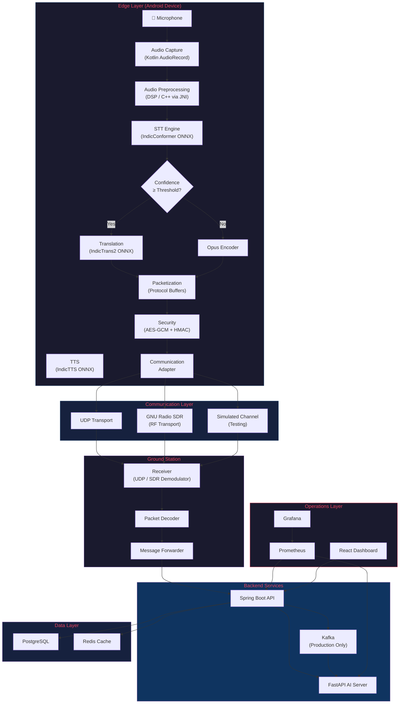
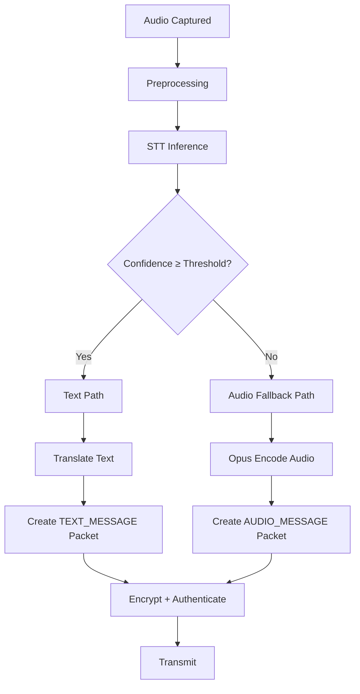
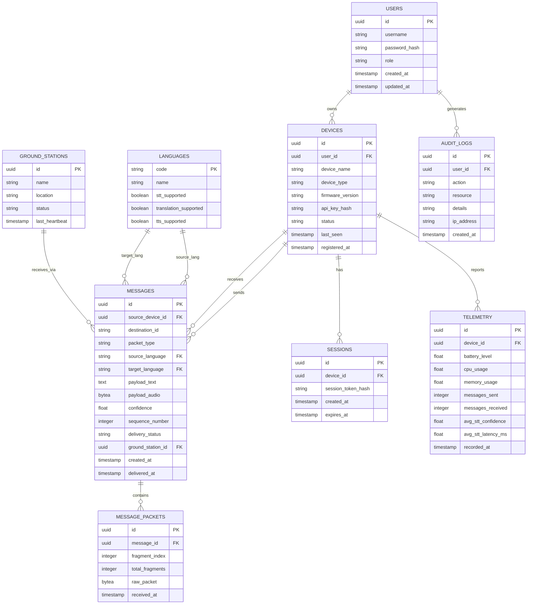
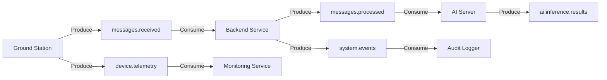
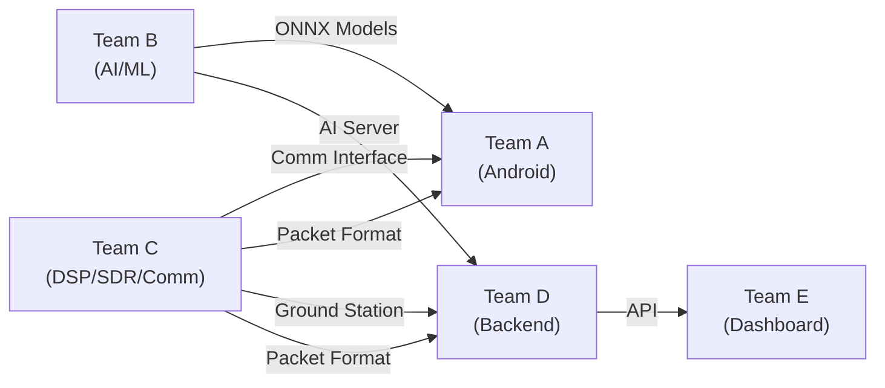
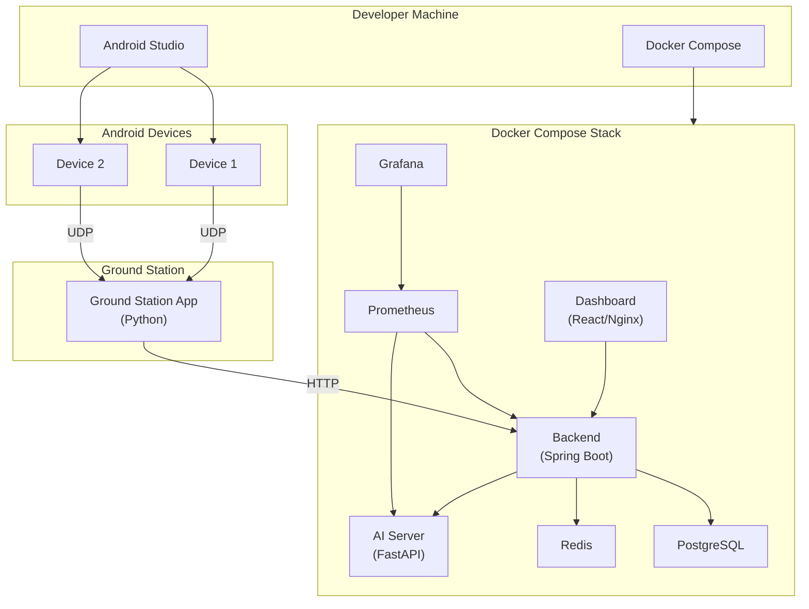
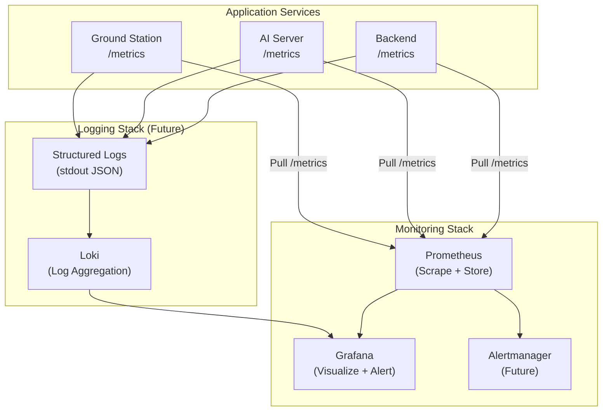
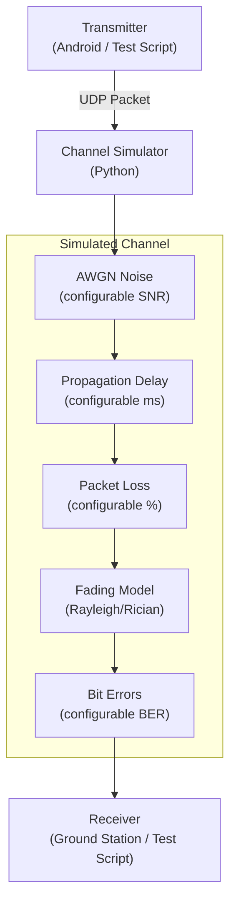

# ITANTRA — Edge AI Multilingual Voice Communication over Software Defined Radio

> **Offline-first, low-bandwidth, multilingual voice communication powered by on-device AI and Software Defined Radio.**

**Itantra** is an adaptive communication system that converts human speech into compact semantic information using edge AI, translates it across Indian languages, and transmits it efficiently over bandwidth-constrained links — including RF channels via Software Defined Radio. When speech recognition is unreliable, the system gracefully falls back to compressed audio transmission, ensuring communication never fails silently.

**Status:** `MVP TARGET` — Architecture finalized, implementation in progress.

---

## Table of Contents

1. [Executive Summary](#1-executive-summary)
2. [Problem Statement](#2-problem-statement)
3. [Problem Analysis](#3-problem-analysis)
4. [Proposed Solution](#4-proposed-solution)
5. [Core Innovation / Novelty](#5-core-innovation--novelty)
6. [Existing System vs Proposed System](#6-existing-system-vs-proposed-system)
7. [System Objectives](#7-system-objectives)
8. [Scope](#8-scope)
9. [Functional Requirements](#9-functional-requirements)
10. [Non-Functional Requirements](#10-non-functional-requirements)
11. [System Use Cases](#11-system-use-cases)
12. [System Architecture](#12-system-architecture)
13. [Detailed Data Flow](#13-detailed-data-flow)
14. [Component-by-Component Technical Explanation](#14-component-by-component-technical-explanation)
15. [Technology Selection Matrix](#15-technology-selection-matrix)
16. [Detailed Methodology](#16-detailed-methodology)
17. [Adaptive Communication Algorithm](#17-adaptive-communication-algorithm)
18. [Bandwidth Optimization Strategy](#18-bandwidth-optimization-strategy)
19. [Reliability Architecture](#19-reliability-architecture)
20. [Failure Scenarios and Recovery](#20-failure-scenarios-and-recovery)
21. [Security Architecture](#21-security-architecture)
22. [Privacy and Data Handling](#22-privacy-and-data-handling)
23. [SRS Traceability Matrix](#23-srs-traceability-matrix)
24. [API Design](#24-api-design)
25. [Packet Structure](#25-packet-structure)
26. [Database Design](#26-database-design)
27. [Redis Usage](#27-redis-usage)
28. [Kafka Architecture](#28-kafka-architecture)
29. [Monitoring and Observability](#29-monitoring-and-observability)
30. [Testing Strategy](#30-testing-strategy)
31. [Reliability Metrics](#31-reliability-metrics)
32. [Feasibility Analysis](#32-feasibility-analysis)
33. [Risk Analysis](#33-risk-analysis)
34. [Limitations](#34-limitations)
35. [Novelty Validation](#35-novelty-validation)
36. [Competitive / Existing Solution Comparison](#36-competitive--existing-solution-comparison)
37. [Project Modules](#37-project-modules)
38. [Team Division of Work](#38-team-division-of-work)
39. [Development Roadmap](#39-development-roadmap)
40. [MVP Definition](#40-mvp-definition)
41. [Demo Scenario](#41-demo-scenario)
42. [PPT Preparation Section](#42-ppt-preparation-section)
43. [Judge / Viva Questions](#43-judge--viva-questions)
44. [Evidence and Validation Plan](#44-evidence-and-validation-plan)
45. [Repository Structure](#45-repository-structure)
46. [Configuration and Environment](#46-configuration-and-environment)
47. [Installation and Setup](#47-installation-and-setup)
48. [Local Development](#48-local-development)
49. [Deployment Architecture](#49-deployment-architecture)
50. [Observability Architecture](#50-observability-architecture)
51. [Simulation Architecture](#51-simulation-architecture)
52. [Engineering Tradeoffs](#52-engineering-tradeoffs)
53. [Acceptance Criteria](#53-acceptance-criteria)
54. [Glossary](#54-glossary)
55. [Final Architecture Summary](#55-final-architecture-summary)
56. [Final Team Checklist](#56-final-team-checklist)

---

## 1. Executive Summary

Itantra is an **offline-first, multilingual, low-bandwidth voice communication system** that combines Edge AI with Software Defined Radio (SDR) to enable reliable voice communication in environments where conventional Internet or cloud connectivity is unavailable, unreliable, expensive, or bandwidth-constrained.

### What the project is

A modular communication platform that captures human speech on an Android device, processes it locally using on-device AI models to extract compact semantic information (text), translates it across Indian languages, packages it into minimal packets, and transmits it over constrained communication links — including RF channels via GNU Radio SDR. When speech recognition is unreliable, the system automatically falls back to Opus-compressed audio transmission.

### What problem it addresses

In many real-world scenarios — disaster zones, remote rural areas, border regions, military field operations, mountainous terrain, and areas with damaged infrastructure — conventional communication systems fail because they depend on Internet connectivity, cloud AI services, high-bandwidth links, and centralized infrastructure. Additionally, India's linguistic diversity means that users in different regions may speak different languages, creating a communication barrier that existing systems do not address at the transport level.

### Who needs it

- Defense and paramilitary personnel operating in connectivity-denied environments
- Disaster response teams during infrastructure failure
- Government agencies requiring communication in remote/tribal areas
- Field workers in areas with limited or no cellular coverage
- Any organization requiring secure, offline-capable, multilingual communication

### Why existing systems fail

Conventional voice communication systems transmit raw or compressed audio, requiring significant bandwidth. They depend on cloud infrastructure for AI features like translation. They fail completely when Internet connectivity is lost. They do not provide adaptive fallback mechanisms and they do not address multilingual communication at the transport layer.

### How Itantra solves it

1. **Edge-first processing**: Speech-to-text, translation, and text-to-speech run on-device using optimized ONNX models, eliminating cloud dependency for core functionality.
2. **Semantic communication**: Instead of transmitting raw audio (~64–128 kbps), the system transmits compact text representations (often < 1 KB per utterance), dramatically reducing bandwidth when STT confidence is high.
3. **Adaptive fallback**: When STT confidence is low (noisy environment, unsupported accent), the system automatically switches to Opus-compressed audio, ensuring communication continues.
4. **Multilingual translation**: AI4Bharat's IndicTrans2 and IndicConformer models enable real-time translation across Indian languages.
5. **SDR flexibility**: GNU Radio provides a software-configurable RF communication layer for experimentation and deployment over various frequency bands and modulation schemes.
6. **Modular architecture**: Every component — STT, translation, TTS, communication, backend — can be independently upgraded or replaced.

### What makes it different

The novelty is not in individual technologies (STT, translation, SDR all exist independently) but in the **system-level integration**: an adaptive pipeline that intelligently decides whether to transmit text or audio based on AI confidence, processes everything at the edge, translates across Indian languages, and operates over constrained RF links — all as a single coherent system with graceful degradation.

---

## 2. Problem Statement

### Core Problem

Voice communication in connectivity-constrained environments faces multiple simultaneous challenges that no single existing system addresses comprehensively:

**Internet Dependency.** Modern voice communication systems (VoIP, messaging apps, cloud-based translators) require persistent Internet connectivity. In disaster zones, remote areas, or during infrastructure failure, this connectivity is unavailable.

**Bandwidth Constraints.** Raw voice audio at 16 kHz mono PCM consumes approximately 256 kbps. Even compressed audio (Opus at acceptable quality) requires 16–64 kbps. Over constrained RF links (narrowband radio, satellite, mesh networks), these data rates may be prohibitive or extremely expensive.

**Linguistic Diversity.** India has 22 scheduled languages and hundreds of dialects. Field personnel from different states may not share a common language. Existing systems do not provide real-time translation at the communication layer.

**Cloud AI Dependency.** State-of-the-art speech recognition and translation services (Google Translate, Azure Speech) require cloud connectivity. When the network is down, these services are completely unavailable.

**Large Audio Payloads.** A 10-second voice message at Opus 32 kbps produces ~40 KB of data. The equivalent text (a typical spoken sentence) may be 50–200 bytes in UTF-8. This represents a potential order-of-magnitude reduction — **to be validated experimentally**.

**No Graceful Degradation.** Existing systems either work fully (with Internet) or fail completely. There is no adaptive mechanism that adjusts the communication strategy based on current conditions (AI confidence, bandwidth availability, network status).

**Communication During Infrastructure Failure.** Natural disasters, conflict zones, and remote deployments can destroy cellular towers and Internet infrastructure. A system that can operate over direct RF links, independent of existing infrastructure, is essential.

**Latency and Instability.** Even when connectivity exists, satellite or long-distance radio links may introduce high latency and packet loss. Systems designed for reliable Internet connections degrade poorly under these conditions.

### What is wrong with existing approaches?

| Limitation | Description |
|---|---|
| Cloud-only AI | All major translation/STT services require Internet |
| High bandwidth assumption | VoIP and messaging apps assume broadband-level connectivity |
| No adaptive transmission | Systems transmit audio regardless of whether text would suffice |
| Single language | Most radio communication systems operate in one language only |
| No edge processing | AI processing happens in the cloud, creating a single point of failure |
| Binary failure mode | Systems either work fully or fail completely — no graceful degradation |
| No RF flexibility | Consumer apps cannot operate over arbitrary RF channels |

> **Note:** Some limitations described above are well-documented in literature (e.g., bandwidth requirements of audio codecs, cloud dependency of commercial translation APIs). Others (e.g., the magnitude of bandwidth savings from semantic transmission in our specific pipeline) are **assumptions that must be validated experimentally** during development.

---

## 3. Problem Analysis

### Problem A — Connectivity

**Challenge:** Internet connectivity may be unavailable, intermittent, or prohibitively expensive in the target operating environment.

**Impact:** All cloud-dependent services (STT, translation, TTS, messaging, coordination) become unavailable.

**Proposed Solution:** Deploy AI models on-device (edge inference) so that core speech processing functionality does not require any network connectivity. Use direct device-to-device or device-to-ground-station RF links for communication.

---

### Problem B — Bandwidth

**Challenge:** Transmitting raw or compressed audio consumes significant bandwidth. Constrained links (narrowband radio, satellite) may not support continuous audio streaming.

**Impact:** Voice communication becomes impractical or extremely expensive over low-bandwidth links.

**Proposed Solution:** When STT confidence is high, transmit compact text/semantic representations instead of audio. Text for a typical spoken sentence is orders of magnitude smaller than the corresponding compressed audio. When STT is unreliable, fall back to Opus-compressed audio at a configurable bitrate.

**Quantitative Context (to be validated):**
- 10 seconds of Opus audio at 24 kbps ≈ 30 KB
- Equivalent text in UTF-8 ≈ 50–300 bytes (language-dependent)
- Potential reduction: **90–99%** — *this is a theoretical estimate and must be measured experimentally with real speech data across supported languages*

---

### Problem C — Language Diversity

**Challenge:** India has 22 scheduled languages. Field personnel from different regions may speak Hindi, Tamil, Telugu, Bengali, Marathi, or other languages. Communication across language barriers is essential.

**Impact:** Without translation, users speaking different languages cannot communicate effectively.

**Proposed Solution:** Integrate AI4Bharat's IndicTrans2 translation models, which support translation between major Indian languages. Run translation either on-device (for supported model sizes) or on a connected AI server when available.

---

### Problem D — Edge Computing

**Challenge:** Cloud AI services are the standard approach for speech recognition and translation, but they require Internet connectivity.

**Impact:** In offline environments, no AI-powered communication features are available.

**Proposed Solution:** Export AI models (IndicConformer for STT, IndicTrans2 for translation) to ONNX format and run them using ONNX Runtime on Android devices. This enables full AI pipeline execution without any server connectivity.

**Constraints:** Edge models may be less accurate than server-hosted models due to quantization and model size limitations. This tradeoff is acceptable for the target use case.

---

### Problem E — Speech Recognition Reliability

**Challenge:** STT accuracy degrades significantly in noisy environments, with unfamiliar accents, or with unsupported languages/dialects.

**Impact:** If STT output is inaccurate and transmitted as text, the receiver gets a garbled message — potentially worse than no message.

**Proposed Solution:** Implement confidence scoring on STT output. When confidence is above a configurable threshold, transmit text. When confidence is below the threshold, fall back to Opus-compressed audio. This adaptive approach ensures that communication quality never drops below the audio baseline.

---

### Problem F — Reliability and Fault Tolerance

**Challenge:** Any single component (STT engine, translation model, network link, server) may fail at any time.

**Impact:** A rigid pipeline fails completely when any component fails.

**Proposed Solution:** Design a layered reliability architecture:
- **AI fallback:** STT failure → Opus audio fallback
- **Network fallback:** Server unavailable → edge-only mode
- **Transport reliability:** Packet loss → application-level ACK/retry
- **Backend reliability:** Service failure → health checks, restart, buffering

---

### Problem G — Communication Layer Flexibility

**Challenge:** The system must operate over various communication links: IP networks (UDP/QUIC), direct RF links (via SDR), satellite, mesh networks.

**Impact:** A system designed for only one transport type cannot adapt to different deployment scenarios.

**Proposed Solution:** Abstract the communication layer behind a transport interface. Implement concrete adapters for UDP (IP networks), QUIC (reliable IP), and GNU Radio SDR (RF links). The packet format remains the same regardless of transport.

---

## 4. Proposed Solution

### Primary Pipeline — Semantic Communication

When speech recognition confidence is high, the system transmits compact text representations:

```
Speech (User A)
 ↓
Audio Capture (Android, 16kHz PCM)
 ↓
Audio Preprocessing (VAD, noise reduction, normalization)
 ↓
Edge STT (IndicConformer via ONNX Runtime)
 ↓
Confidence Evaluation
 ↓ [confidence ≥ threshold]
Language Identification
 ↓
Translation (IndicTrans2 — source language → target language)
 ↓
Text/Semantic Representation
 ↓
Packetization (Protocol Buffers / CBOR)
 ↓
Security (encryption + authentication)
 ↓
Communication (UDP / QUIC / SDR RF)
 ↓
Ground Station / Receiver
 ↓
Packet Decoding + Validation
 ↓
Translation (if receiver language differs)
 ↓
TTS (IndicTTS — text → speech)
 ↓
Audio Output (User B)
```

### Fallback Pipeline — Compressed Audio

When STT confidence is low, the system transmits compressed audio:

```
Speech (User A)
 ↓
Audio Capture (Android, 16kHz PCM)
 ↓
Audio Preprocessing (VAD, noise reduction, normalization)
 ↓
Edge STT (IndicConformer via ONNX Runtime)
 ↓
Confidence Evaluation
 ↓ [confidence < threshold]
Opus Audio Compression (configurable bitrate: 16–64 kbps)
 ↓
Packetization (Protocol Buffers / CBOR)
 ↓
Security (encryption + authentication)
 ↓
Communication (UDP / QUIC / SDR RF)
 ↓
Ground Station / Receiver
 ↓
Packet Decoding + Validation
 ↓
Opus Decoding
 ↓
Audio Output (User B)
```

### Why Adaptive Architecture Improves Robustness

The dual-path design ensures that:

1. **Best case (high STT confidence):** Bandwidth is reduced by transmitting text instead of audio. Translation is possible. The receiver gets translated text that can be converted to speech in their language.

2. **Degraded case (low STT confidence):** The original speech is preserved via Opus compression. Bandwidth is higher but the message is guaranteed to be intelligible. No translation is available in this path (the audio is language-specific).

3. **No silent failure:** The system never silently transmits garbled text. If STT is unreliable, it admits this and falls back to audio.

---

## 5. Core Innovation / Novelty

> **Important:** The novelty of this system lies in the **system-level integration and adaptive architecture**, not in claiming that individual technologies (STT, translation, SDR) are new. Each underlying technology is established. The innovation is in how they are combined.

### 5.1 Edge-First Multilingual Communication

**What it is:** Running the complete AI pipeline — speech recognition, translation, and text-to-speech — on the mobile device itself, without requiring any server connectivity.

**Why it matters:** This enables AI-powered multilingual communication in environments where no Internet exists. Existing solutions (Google Translate, Azure Cognitive Services) are cloud-only.

**Technical approach:** Export AI4Bharat models (IndicConformer, IndicTrans2, IndicTTS) to ONNX format. Run inference using ONNX Runtime on Android. Accept the tradeoff of potentially reduced accuracy in exchange for complete offline capability.

**Novelty level:** The individual models exist (AI4Bharat). ONNX Runtime exists. The novelty is in deploying this specific combination for edge-first multilingual communication over constrained links.

### 5.2 Semantic Communication

**What it is:** Instead of always transmitting compressed audio (the conventional approach), extract the semantic content of speech (text) and transmit that instead.

```
Traditional approach:
  Voice → Audio Codec → Compressed Audio → Transmission
  Payload: ~30 KB for 10s of speech (Opus @ 24 kbps)

Itantra approach (when STT confident):
  Voice → STT → Text → Transmission
  Payload: ~50–300 bytes for equivalent text
```

**Why it matters:** This can reduce bandwidth consumption by 1–2 orders of magnitude, making voice communication feasible over extremely constrained links (narrowband radio, low-rate satellite).

**Caveat:** The actual bandwidth savings depend on speech duration, language, STT output verbosity, packet overhead, and metadata. **These savings must be measured experimentally.** The theoretical estimates above are directional, not validated results.

**Novelty level:** The concept of semantic communication is an active research area in telecommunications. Applying it specifically to multilingual Indian-language communication over SDR, with adaptive fallback, is a system-level contribution.

### 5.3 Adaptive Fallback

**What it is:** A decision mechanism that selects the transmission mode based on STT confidence:

```
STT confidence ≥ threshold  →  Transmit text (semantic path)
STT confidence < threshold   →  Transmit Opus audio (fallback path)
```

**Why it matters:** This eliminates the binary failure mode of pure-STT systems. The system degrades gracefully rather than failing silently.

**Novelty level:** Confidence-based routing in speech systems exists in other contexts (e.g., voice assistants deciding when to ask for clarification). Applying it as a transmission-mode selector in a constrained-bandwidth communication system is a system-level design contribution.

### 5.4 Multilingual Indian-Language Communication

**What it is:** Real-time translation between Indian languages (Hindi, Tamil, Telugu, Bengali, Marathi, Kannada, Malayalam, Gujarati, and others supported by IndicTrans2) at the communication layer.

**Why it matters:** India's linguistic diversity is a real operational challenge. A Hindi-speaking coordinator needs to communicate with Tamil-speaking field workers. Existing radio systems do not provide this capability.

**Technical approach:** AI4Bharat's IndicTrans2 supports many-to-many translation across Indian languages. The model can be deployed on-device (quantized) or on a backend AI server.

### 5.5 Offline-First Architecture

**What it is:** The system is designed to function fully without any Internet or server connectivity. Server features enhance the system when available but are not required for core communication.

```
Offline mode:
  Edge STT → Edge Translation → Packetization → RF/Direct Communication

Online mode (enhanced):
  Edge STT → Server Translation (higher accuracy) → Packetization → IP/RF Communication
  + Backend storage, monitoring, operator dashboard
```

### 5.6 Hybrid Edge + Server AI

**What it is:** A dual-processing architecture where:
- **Edge AI** provides low-latency, offline-capable inference using quantized ONNX models
- **Server AI** provides higher-accuracy inference using full-precision models when connectivity is available

**When to use each:**

| Scenario | Processing Location | Rationale |
|---|---|---|
| No Internet | Edge | Only option available |
| Low bandwidth | Edge | Avoid consuming bandwidth for AI API calls |
| High bandwidth + accuracy needed | Server | Full models produce better results |
| Real-time constraint | Edge | Eliminates network round-trip latency |
| Batch processing | Server | More compute available |

### 5.7 SDR Integration

**What it is:** Using GNU Radio and compatible SDR hardware (RTL-SDR, HackRF, USRP, LimeSDR) to create a software-configurable RF communication layer.

**Why it matters:** SDR allows experimentation with different modulation schemes, frequency bands, bandwidths, and protocols without changing hardware. This makes the communication layer adaptable to different regulatory environments and operational requirements.

**Novelty level:** SDR is established technology. GNU Radio is established software. The novelty is in integrating SDR as a transport layer for an AI-powered semantic communication system.

### 5.8 Modular Architecture

**What it is:** Each component of the system — STT engine, translation model, TTS engine, communication transport, backend services — is designed as an independent, replaceable module with well-defined interfaces.

**Why it matters:**
- STT engine can be upgraded from IndicConformer to a future, more accurate model without changing the rest of the system
- Communication transport can switch from UDP to QUIC to SDR without affecting the AI pipeline
- Backend can be scaled independently of edge processing
- Individual components can be tested in isolation

---

## 6. Existing System vs Proposed System

| Parameter | Existing/Conventional Approach | Proposed Approach (Itantra) |
|---|---|---|
| **Internet Dependency** | Required for AI features (translation, STT) | Core AI runs on-device; Internet enhances but is not required |
| **Bandwidth** | High — transmits compressed audio (16–128 kbps) | Adaptive — transmits text (~0.5–2 kbps effective) when STT is confident; audio fallback otherwise |
| **Language Support** | Single language per system, or cloud-based translation | On-device multilingual translation across Indian languages |
| **Offline Capability** | None for AI features; limited for basic audio | Full AI pipeline available offline |
| **AI Processing** | Cloud-only | Edge-first with optional server enhancement |
| **Audio Transmission** | Always transmits audio | Transmits text when possible, audio when necessary |
| **Fallback Mechanism** | None — fails when primary path fails | Adaptive: text → audio fallback based on confidence |
| **RF/SDR Support** | Not available in consumer apps | GNU Radio SDR integration for flexible RF communication |
| **Scalability** | Cloud-dependent scaling | Edge processing scales with devices; backend scales independently |
| **Reliability** | Single point of failure (Internet/cloud) | Multi-layer reliability: edge fallback, transport retry, audio fallback |
| **Deployment Flexibility** | Public cloud infrastructure required | Deployable on private/air-gapped/government infrastructure |
| **Security** | Vendor-dependent | Application-level encryption, designed for government-compatible deployment |
| **Monitoring** | Vendor dashboard or none | Self-hosted Prometheus + Grafana observability stack |

> **Note:** The bandwidth comparison is based on theoretical analysis. Actual performance depends on language, speech content, model accuracy, and link conditions. **To be validated experimentally.**

---

## 7. System Objectives

### Primary Objectives

| ID | Objective | Measurable Goal | Status |
|---|---|---|---|
| OBJ-01 | Multilingual voice communication | Support ≥ 2 Indian language pairs for STT + translation + TTS | **MVP Target** |
| OBJ-02 | Bandwidth reduction via semantic transmission | Demonstrate measurable payload reduction (text vs. audio) for supported languages | **To be validated** |
| OBJ-03 | Offline/edge AI inference | Complete STT → Translation pipeline on Android without network | **MVP Target** |
| OBJ-04 | Audio fallback | Automatic Opus fallback when STT confidence is below threshold | **MVP Target** |
| OBJ-05 | Constrained-link communication | Transmit/receive packets over UDP and simulated RF channel | **MVP Target** |
| OBJ-06 | SDR experimentation | Transmit/receive packets via GNU Radio with SDR hardware | **Proposed** |
| OBJ-07 | Operational monitoring | Expose system metrics via Prometheus; visualize via Grafana | **Proposed** |
| OBJ-08 | Operator dashboard | Web-based dashboard showing device status, messages, metrics | **Proposed** |
| OBJ-09 | Modular architecture | Each component independently replaceable/testable | **MVP Target** |
| OBJ-10 | Secure communication | End-to-end packet encryption and authentication | **MVP Target** |

### Engineering Goals

- **STT Latency (Edge):** < 3 seconds for a 10-second utterance on a mid-range Android device — **Target, to be validated**
- **Translation Latency (Edge):** < 1 second per sentence — **Target, to be validated**
- **Packet Size (Text):** < 512 bytes for a typical single-sentence message — **Target, to be validated**
- **Packet Size (Audio):** Configurable via Opus bitrate selection — **Known, based on Opus specifications**
- **End-to-End Latency (Text Path):** < 5 seconds from speech to received text — **Target, to be validated**

---

## 8. Scope

### In Scope (Current Project / Prototype)

- Android application with audio capture and playback
- On-device STT using IndicConformer (ONNX)
- On-device translation using IndicTrans2 (ONNX) for ≥ 2 language pairs (e.g., Hindi ↔ Tamil)
- On-device TTS using IndicTTS (ONNX)
- Confidence-based adaptive transmission (text vs. Opus audio)
- Packet serialization using Protocol Buffers
- UDP-based communication (device ↔ ground station or device ↔ device)
- Simulated communication channel (noise, delay, packet loss)
- Basic ground station receiver (Linux)
- Spring Boot backend with PostgreSQL for message storage
- FastAPI AI server for server-side inference
- Basic React operator dashboard
- Docker containerization of backend services
- Basic security (AES encryption of packet payloads, HMAC authentication)
- Prometheus + Grafana monitoring (basic metrics)

### Out of Scope (Not in Initial Prototype)

- Real SDR RF transmission (requires hardware; will use simulated channel)
- Kubernetes orchestration
- Kafka messaging (direct HTTP/gRPC communication for prototype)
- QUIC transport
- Production-grade key management / PKI
- Regulatory compliance certification
- Multi-ground-station coordination
- Real-time streaming (initial version uses push-to-talk messages)
- Video communication
- Support for all 22 scheduled Indian languages (prototype targets 2–4)

### Future Scope

- Full SDR integration with USRP/LimeSDR hardware
- Mesh networking between devices
- Kubernetes-based production deployment
- Kafka event streaming for distributed processing
- QUIC transport for reliable IP communication
- Voice activity detection (VAD) for automatic segmentation
- Speaker diarization
- Dialect-specific model fine-tuning
- Satellite communication integration
- Government/NIC infrastructure deployment
- Real-time duplex communication
- Support for additional language pairs
- Federation between multiple ground station networks

---

## 9. Functional Requirements

### Audio and Speech Processing

#### FR-001 — Audio Capture
The Android application shall capture microphone audio at 16 kHz, 16-bit, mono PCM format using the Android AudioRecord API.

#### FR-002 — Audio Preprocessing
The system shall apply preprocessing to captured audio including:
- Noise normalization
- Amplitude normalization
- Optional voice activity detection (VAD) to trim silence

#### FR-003 — Speech-to-Text
The system shall convert preprocessed audio to text using the IndicConformer STT model running via ONNX Runtime on the Android device.

#### FR-004 — STT Confidence Scoring
The STT engine shall produce a confidence score (0.0 – 1.0) for each transcription. The scoring methodology shall be documented.

#### FR-005 — Language Detection / Selection
The system shall identify the source language automatically or accept manual language selection from the user. For the MVP, manual selection is acceptable.

#### FR-006 — Translation
The system shall translate text from the source language to the target language using IndicTrans2, supporting at minimum Hindi ↔ Tamil and Hindi ↔ English pairs.

#### FR-007 — Text-to-Speech
The system shall convert translated text to speech audio using IndicTTS, producing audio playable on the receiving device.

#### FR-008 — Opus Audio Fallback
When STT confidence is below the configured threshold, the system shall encode the preprocessed audio using the Opus codec at a configurable bitrate (default: 24 kbps) and transmit it as an audio packet.

### Communication

#### FR-009 — Packet Serialization
The system shall serialize messages into Protocol Buffers format with a defined packet schema including metadata (message ID, source/target language, timestamp, sequence number, packet type).

#### FR-010 — UDP Transmission
The system shall transmit serialized packets over UDP to a configured destination (ground station or peer device).

#### FR-011 — Packet Encryption
The system shall encrypt packet payloads using AES-256-GCM (or equivalent approved symmetric cipher) before transmission.

#### FR-012 — Packet Authentication
The system shall include HMAC-SHA256 (or equivalent) authentication tags to verify packet integrity and authenticity.

#### FR-013 — Application-Level ACK
The receiver shall send an acknowledgment (ACK) packet for each received message. The sender shall retry transmission if no ACK is received within a configurable timeout.

#### FR-014 — Sequence Numbering
Each packet shall include a monotonically increasing sequence number for ordering and duplicate detection.

### Ground Station

#### FR-015 — Packet Reception
The ground station shall receive UDP packets (or SDR-demodulated packets) and validate their integrity.

#### FR-016 — Packet Decoding
The ground station shall deserialize Protocol Buffers packets and extract message content.

#### FR-017 — Message Forwarding
The ground station shall forward decoded messages to the backend service via HTTP/gRPC.

### Backend

#### FR-018 — Device Registration
The backend shall allow authorized devices to register with a unique device ID, supported languages, and device metadata.

#### FR-019 — Message Storage
The backend shall store received messages in PostgreSQL with full metadata (sender, receiver, languages, timestamp, packet type, delivery status).

#### FR-020 — Message Retrieval
The backend shall expose APIs to retrieve messages by ID, device, time range, and status.

#### FR-021 — Device Status
The backend shall track device online/offline status based on heartbeat messages.

#### FR-022 — Server-Side AI Inference
The AI server shall provide STT, translation, and TTS services via FastAPI endpoints for cases where server processing is preferred or edge processing is unavailable.

### Dashboard

#### FR-023 — Device List
The operator dashboard shall display all registered devices with their status (online/offline/last seen).

#### FR-024 — Message Log
The dashboard shall display a chronological log of messages with metadata.

#### FR-025 — System Metrics
The dashboard shall display key system metrics (message volume, delivery success rate, STT confidence distribution, fallback rate).

#### FR-026 — Communication Status
The dashboard shall display communication link status and quality indicators.

### Monitoring

#### FR-027 — Metrics Exposure
All backend services shall expose Prometheus-compatible metrics endpoints.

#### FR-028 — Metric Collection
Prometheus shall scrape metrics from all services at a configurable interval.

#### FR-029 — Visualization
Grafana shall provide dashboards for AI metrics, communication metrics, and infrastructure metrics.

#### FR-030 — Health Checks
All services shall expose health check endpoints returning service status.

---

## 10. Non-Functional Requirements

### Performance

#### NFR-001 — STT Latency
Edge STT inference shall complete within 3 seconds for a 10-second audio input on a device with ≥ 4 GB RAM and a mid-range SoC (e.g., Snapdragon 600 series). **Target — to be validated.**

#### NFR-002 — Translation Latency
Edge translation shall complete within 1 second per sentence. **Target — to be validated.**

#### NFR-003 — TTS Latency
Edge TTS shall produce audio within 2 seconds for a typical translated sentence. **Target — to be validated.**

#### NFR-004 — Packet Processing
Packet serialization, encryption, and transmission shall complete within 100 ms. **Target.**

#### NFR-005 — End-to-End Latency
The complete sender pipeline (audio capture → preprocessing → STT → translation → packetization → encryption → transmission) shall complete within 5 seconds for the text path and 2 seconds for the audio fallback path. **Target — to be validated.**

### Reliability

#### NFR-006 — Offline Operation
The system shall provide STT, translation, and local packet preparation without any network connectivity.

#### NFR-007 — Fallback Behavior
The system shall fall back to Opus audio within 500 ms of determining low STT confidence. **Target.**

#### NFR-008 — Packet Retry
The system shall retry failed packet transmissions up to a configurable number of times (default: 3) with exponential backoff.

#### NFR-009 — Packet Loss Tolerance
The system shall detect and recover from packet loss using sequence numbers and ACK-based retransmission.

### Scalability

#### NFR-010 — Device Scale
The backend shall support at least 100 concurrent registered devices for the prototype. **Target.**

#### NFR-011 — Message Throughput
The backend shall process at least 10 messages per second for the prototype. **Target.**

### Security

#### NFR-012 — Encryption
All transmitted packet payloads shall be encrypted using AES-256-GCM or equivalent.

#### NFR-013 — Authentication
All packets shall be authenticated using HMAC-SHA256 or equivalent.

#### NFR-014 — Key Storage
Cryptographic keys shall be stored in Android Keystore (device) and secure environment variables or secrets management (server).

#### NFR-015 — API Authentication
Backend APIs shall require authentication via API keys or JWT tokens.

#### NFR-016 — Audit Logging
Security-relevant events (device registration, authentication failures, message transmission) shall be logged.

### Availability

#### NFR-017 — Service Availability
Backend services shall target 99% availability during testing. **Target.**

#### NFR-018 — Graceful Degradation
When any non-essential service is unavailable, the system shall continue providing core functionality (edge processing + communication).

### Maintainability

#### NFR-019 — Modularity
Each service (backend, AI server, dashboard) shall be independently deployable.

#### NFR-020 — Logging
All services shall produce structured logs (JSON format recommended) to stdout/stderr.

#### NFR-021 — Documentation
All APIs, packet formats, and configuration parameters shall be documented.

### Portability

#### NFR-022 — Android Support
The Android application shall support Android 8.0 (API 26) and above.

#### NFR-023 — Linux Support
The ground station and backend services shall run on Ubuntu 20.04 LTS or later.

#### NFR-024 — Containerization
Backend services shall be containerized using Docker.

### Usability

#### NFR-025 — UI Simplicity
The Android application shall provide a simple push-to-talk interface with language selection, minimal configuration, and clear communication status.

#### NFR-026 — Language Selection
The user shall be able to select source and target languages from a dropdown of supported languages.

---

## 11. System Use Cases

### UC-001 — Send Multilingual Voice Message

| Field | Description |
|---|---|
| **Actor** | Field User (Android device) |
| **Preconditions** | Device is registered. Source and target languages are selected. Communication link is available. |
| **Main Flow** | 1. User presses push-to-talk button. 2. User speaks message. 3. User releases button. 4. System preprocesses audio. 5. System runs STT (edge). 6. STT confidence ≥ threshold. 7. System translates text. 8. System creates text packet. 9. System encrypts and transmits packet. 10. System displays "Sent" status. |
| **Alternative Flow** | 6a. STT confidence < threshold → System encodes audio with Opus → Creates audio packet → Encrypts and transmits. |
| **Failure Conditions** | Communication link unavailable → Message queued locally for later transmission. STT engine crashes → Audio fallback automatically. |
| **Expected Result** | Packet is transmitted. Sender sees confirmation. If ACK received, delivery confirmed. |

### UC-002 — Receive Translated Message

| Field | Description |
|---|---|
| **Actor** | Receiving User (Android device or Ground Station) |
| **Preconditions** | Device is listening on the configured communication channel. |
| **Main Flow** | 1. Receiver receives packet. 2. Validates integrity (HMAC). 3. Decrypts payload. 4. Determines packet type (text or audio). 5a. Text packet: Translates to receiver's language if needed → TTS → Audio output. 5b. Audio packet: Opus decode → Audio output. 6. Sends ACK. |
| **Alternative Flow** | 5a-alt. Translation not needed (same language) → TTS directly. |
| **Failure Conditions** | HMAC validation fails → Packet discarded, logged. Decryption fails → Packet discarded, logged. TTS fails → Display text only. |
| **Expected Result** | Receiver hears translated speech (text path) or original audio (fallback path). |

### UC-003 — Offline Communication

| Field | Description |
|---|---|
| **Actor** | Field User operating without Internet connectivity |
| **Preconditions** | Device has ONNX models loaded. Direct RF or local network link exists to receiver. |
| **Main Flow** | 1. User speaks message. 2. Edge STT processes audio. 3. Edge translation converts text. 4. Packet created and encrypted. 5. Transmitted over direct link (UDP/RF). 6. No backend services involved. |
| **Alternative Flow** | If direct link to peer is unavailable, message is queued locally until link is restored. |
| **Failure Conditions** | Edge models not loaded → Error displayed to user. No communication link available → Message queued. |
| **Expected Result** | Communication succeeds without Internet. Messages processed entirely on-device. |

### UC-004 — STT Failure and Audio Fallback

| Field | Description |
|---|---|
| **Actor** | System (automatic) |
| **Preconditions** | User has spoken a message. STT has been attempted. |
| **Main Flow** | 1. STT processes audio. 2. Confidence score is below threshold. 3. System automatically encodes audio with Opus. 4. Creates audio-type packet. 5. Encrypts and transmits. 6. UI indicates "Audio mode" to sender. |
| **Alternative Flow** | N/A — this use case is itself an alternative flow. |
| **Failure Conditions** | Opus encoding fails → Error logged, message not sent, user notified. |
| **Expected Result** | Audio message is transmitted despite STT failure. Receiver hears original audio (untranslated). |

### UC-005 — Ground Station Packet Reception

| Field | Description |
|---|---|
| **Actor** | Ground Station Operator / Automated System |
| **Preconditions** | Ground station is running. Communication link is active. |
| **Main Flow** | 1. Ground station receives packet (UDP or SDR-demodulated). 2. Validates packet integrity. 3. Decodes Protocol Buffers payload. 4. Forwards message to backend via HTTP. 5. Sends ACK to sender. 6. Logs reception event. |
| **Alternative Flow** | Backend unreachable → Ground station queues message locally for later forwarding. |
| **Failure Conditions** | Packet integrity check fails → Discarded, logged. Deserialization fails → Discarded, logged. |
| **Expected Result** | Message is received, validated, and forwarded to backend for storage and operator visibility. |

### UC-006 — Operator Monitoring

| Field | Description |
|---|---|
| **Actor** | Operator (React dashboard user) |
| **Preconditions** | Dashboard is running. Backend is accessible. |
| **Main Flow** | 1. Operator opens dashboard. 2. Views registered devices and their status. 3. Views message log with metadata. 4. Views system metrics (throughput, latency, fallback rate). 5. Views Grafana dashboards for detailed metrics. |
| **Alternative Flow** | N/A |
| **Failure Conditions** | Backend unavailable → Dashboard shows connection error. Metrics unavailable → Dashboard shows stale data with timestamp. |
| **Expected Result** | Operator has real-time visibility into system status. |

### UC-007 — Device Registration

| Field | Description |
|---|---|
| **Actor** | Device Administrator |
| **Preconditions** | Backend is running. Network access to backend exists. |
| **Main Flow** | 1. Administrator configures device ID and credentials. 2. Device sends registration request to backend. 3. Backend validates and stores device record. 4. Device receives registration confirmation and configuration. |
| **Alternative Flow** | Device was previously registered → Backend updates device record. |
| **Failure Conditions** | Invalid credentials → Registration rejected. Backend unreachable → Device operates in edge-only mode with pre-configured settings. |
| **Expected Result** | Device is registered and can participate in the communication network. |

### UC-008 — Server-Assisted AI Processing

| Field | Description |
|---|---|
| **Actor** | Android Application (automatic) |
| **Preconditions** | Device has IP connectivity to AI server. AI server is running. |
| **Main Flow** | 1. Device captures and preprocesses audio. 2. Device sends audio to AI server for STT (higher accuracy model). 3. AI server returns transcript with confidence. 4. Device sends text to AI server for translation. 5. Device uses server translation result. 6. Remainder of pipeline (packetization, encryption, transmission) runs on device. |
| **Alternative Flow** | AI server response time exceeds timeout → Fall back to edge inference. |
| **Failure Conditions** | AI server unreachable → Use edge models. Server returns error → Use edge models. |
| **Expected Result** | Higher accuracy STT and translation when server is available. |

### UC-009 — Network Recovery

| Field | Description |
|---|---|
| **Actor** | System (automatic) |
| **Preconditions** | Device was operating in offline mode. Network connectivity has been restored. |
| **Main Flow** | 1. Device detects network availability (periodic connectivity check). 2. Device sends queued messages to backend/ground station. 3. Device receives queued messages from backend. 4. Device optionally re-registers with backend. 5. System transitions from edge-only mode to hybrid mode. |
| **Alternative Flow** | Partial connectivity → System transmits queued messages but continues edge processing. |
| **Failure Conditions** | Queue is empty → No action needed. Re-registration fails → Continue in edge mode, retry later. |
| **Expected Result** | All queued messages are delivered. System resumes full hybrid operation. |

---

## 12. System Architecture

### Architecture Diagram



### Layer Descriptions

| Layer | Responsibility | Technologies | Classification |
|---|---|---|---|
| **Edge Layer** | Audio capture, DSP, AI inference (STT/Translation/TTS), adaptive fallback, packetization, security | Kotlin, Android, ONNX Runtime, IndicConformer, IndicTrans2, IndicTTS, Protocol Buffers, Opus | **Core** |
| **Communication Layer** | Transport packets between edge devices and ground station | UDP, GNU Radio, Simulated Channel | **Core** (UDP), **Optional** (SDR) |
| **Ground Station** | Receive, validate, decode, and forward packets to backend | Linux, C/C++, Python, GNU Radio | **Core** |
| **Backend Services** | Message management, device management, API, server-side AI | Spring Boot, FastAPI | **Core** (Spring Boot), **Recommended** (FastAPI) |
| **Data Layer** | Persistent storage, caching | PostgreSQL, Redis | **Core** (PostgreSQL), **Recommended** (Redis) |
| **Operations Layer** | Monitoring, visualization, operator interface | Prometheus, Grafana, React | **Recommended** |

---

## 13. Detailed Data Flow

### Sender Flow (Text/Semantic Path)

```
Step 1: Audio Capture
  Input:  Analog speech (microphone)
  Output: PCM byte array (16 kHz, 16-bit, mono)
  Component: Android AudioRecord
  Format: Raw PCM (256 kbps)

Step 2: Preprocessing
  Input:  Raw PCM
  Output: Normalized, noise-reduced PCM
  Component: DSP module (C++ via JNI)
  Operations: DC removal, normalization, optional VAD

Step 3: Speech-to-Text
  Input:  Preprocessed PCM
  Output: (transcript: String, confidence: Float)
  Component: IndicConformer (ONNX Runtime)
  Model size: ~100–300 MB (quantized) — to be validated

Step 4: Confidence Evaluation
  Input:  confidence score
  Output: Decision: TEXT_PATH or AUDIO_PATH
  Logic: confidence ≥ THRESHOLD → TEXT_PATH
         confidence < THRESHOLD → AUDIO_PATH
  THRESHOLD: Configurable, experimental parameter (proposed default: 0.7)

Step 5a (TEXT_PATH): Translation
  Input:  (transcript, source_language, target_language)
  Output: translated_text: String
  Component: IndicTrans2 (ONNX Runtime)

Step 6a: Packetization (Text)
  Input:  translated_text + metadata
  Output: Serialized Protocol Buffers packet
  Payload size: ~50–500 bytes (language-dependent)

Step 5b (AUDIO_PATH): Opus Encoding
  Input:  Preprocessed PCM
  Output: Opus-compressed audio bytes
  Component: Opus codec
  Bitrate: Configurable (default: 24 kbps)

Step 6b: Packetization (Audio)
  Input:  Opus bytes + metadata
  Output: Serialized Protocol Buffers packet
  Payload size: ~3 KB per second of audio at 24 kbps

Step 7: Security
  Input:  Serialized packet
  Output: Encrypted packet with authentication tag
  Operations: AES-256-GCM encryption, HMAC-SHA256

Step 8: Transmission
  Input:  Secured packet
  Output: UDP datagram / RF signal
  Component: Communication adapter (UDP socket or GNU Radio)
```

### Receiver Flow

```
Step 1: Reception
  Input:  UDP datagram / RF signal
  Output: Raw packet bytes
  Component: UDP listener / GNU Radio demodulator

Step 2: Validation
  Input:  Raw packet bytes
  Output: Validated packet or rejection
  Operations: HMAC verification, decryption

Step 3: Decoding
  Input:  Decrypted Protocol Buffers bytes
  Output: Message object (type, content, metadata)

Step 4a (TEXT_MESSAGE): Translation + TTS
  Input:  text + source_language + receiver_language
  Output: Audio PCM
  Operations: Translate if languages differ → TTS

Step 4b (AUDIO_MESSAGE): Opus Decoding
  Input:  Opus bytes
  Output: Audio PCM

Step 5: Audio Output
  Input:  PCM audio
  Output: Speaker audio
  Component: Android AudioTrack
```

### Fallback Decision Flow



---

## 14. Component-by-Component Technical Explanation

### 14.1 Kotlin + Android

| Aspect | Detail |
|---|---|
| **Purpose** | Mobile application platform for user interaction, audio capture, and edge AI inference |
| **Responsibility** | UI (push-to-talk, language selection, status), audio capture/playback, orchestration of the edge AI pipeline, communication |
| **Why Selected** | Kotlin is the official Android language. Android provides access to AudioRecord, ONNX Runtime Android SDK, and network APIs. Largest mobile platform in India. |
| **Input** | User speech (microphone), user interaction (touch) |
| **Output** | Communication packets (to network), audio playback (speaker), UI updates |
| **Interfaces** | AudioRecord API, ONNX Runtime API, UDP sockets, JNI (for C++ DSP) |
| **Implementation** | Kotlin with Android SDK. Coroutines for async operations. MVVM architecture. |
| **Performance** | Audio capture is real-time. AI inference is the bottleneck — mitigated by ONNX optimization. |
| **Failure Modes** | Microphone permission denied, insufficient memory for models, ONNX model not found |
| **Alternatives** | Flutter (cross-platform), React Native, Java |
| **Why Not Alternative** | Kotlin provides direct access to native Android APIs and JNI. Flutter/RN add abstraction overhead for performance-critical audio/AI workloads. Java is verbose compared to Kotlin. |
| **Classification** | **Core** |

### 14.2 PyTorch + ONNX Runtime

| Aspect | Detail |
|---|---|
| **Purpose** | AI model training (PyTorch) and optimized inference (ONNX Runtime) |
| **Responsibility** | PyTorch: training and exporting models. ONNX Runtime: running inference on device and server. |
| **Why Selected** | AI4Bharat models are built with PyTorch. ONNX is the standard interchange format for deploying models to mobile/edge devices. ONNX Runtime supports Android, quantization, and hardware acceleration. |
| **Input** | Audio features (for STT), text (for translation/TTS) |
| **Output** | Transcripts, translated text, synthesized audio |
| **Interfaces** | ONNX Runtime Java/Kotlin API (Android), Python API (server) |
| **Implementation** | Export AI4Bharat models to ONNX using `torch.onnx.export()`. Quantize to INT8 for mobile. Run via ONNX Runtime Mobile. |
| **Performance** | INT8 quantization can reduce model size by ~4x and improve inference speed. GPU delegation available where hardware supports it. |
| **Failure Modes** | Model export incompatibility, quantization quality loss, OOM on low-memory devices |
| **Alternatives** | TensorFlow Lite, NCNN, MNN |
| **Why Not Alternative** | ONNX is the most direct path from PyTorch models. TFLite requires conversion through additional tooling. ONNX Runtime has mature Android support. |
| **Classification** | **Core** |

### 14.3 IndicConformer (AI4Bharat STT)

| Aspect | Detail |
|---|---|
| **Purpose** | Automatic speech recognition for Indian languages |
| **Responsibility** | Convert audio input to text transcription with confidence score |
| **Why Selected** | Purpose-built for Indian languages by AI4Bharat. Supports Hindi, Tamil, Telugu, Bengali, Marathi, Kannada, Malayalam, Gujarati, and more. Open-source. Based on Conformer architecture (state-of-the-art for ASR). |
| **Input** | Preprocessed audio (16 kHz PCM or extracted features) |
| **Output** | (transcript: String, confidence: Float) |
| **Interfaces** | ONNX Runtime inference API |
| **Implementation** | Download pre-trained model from AI4Bharat. Export to ONNX. Quantize. Integrate into Android via ONNX Runtime. |
| **Performance** | Inference time depends on audio length and device capability. **Target: < 3s for 10s audio on mid-range device — to be validated.** |
| **Failure Modes** | Low accuracy in noisy environments, unsupported dialect, model too large for device memory |
| **Alternatives** | Whisper (OpenAI), Wav2Vec2, Google Speech API |
| **Why Not Alternative** | Whisper is general-purpose, not optimized for Indian languages. Google Speech API requires Internet. IndicConformer is specifically trained on Indian language data. |
| **Classification** | **Core** |

### 14.4 IndicTrans2 (AI4Bharat Translation)

| Aspect | Detail |
|---|---|
| **Purpose** | Machine translation between Indian languages |
| **Responsibility** | Translate text from source Indian language to target Indian language |
| **Why Selected** | State-of-the-art for Indian language translation. Supports many-to-many translation across 22+ Indian languages. Open-source. Can be quantized for mobile deployment. |
| **Input** | (source_text: String, source_lang: String, target_lang: String) |
| **Output** | translated_text: String |
| **Interfaces** | ONNX Runtime inference API (edge), FastAPI endpoint (server) |
| **Implementation** | Export IndicTrans2 to ONNX. Deploy quantized version on mobile. Full version on server. |
| **Performance** | Translation latency depends on sentence length and model size. **Target: < 1s per sentence on edge — to be validated.** |
| **Failure Modes** | Translation quality varies by language pair. Low-resource language pairs may produce poor results. |
| **Alternatives** | Google Translate API, MarianMT, NLLB (Meta) |
| **Why Not Alternative** | Google Translate requires Internet. NLLB is general-purpose, not specifically optimized for Indian languages. IndicTrans2 is purpose-built for this use case. |
| **Classification** | **Core** |

### 14.5 IndicTTS (AI4Bharat Text-to-Speech)

| Aspect | Detail |
|---|---|
| **Purpose** | Convert translated text to natural-sounding speech in Indian languages |
| **Responsibility** | Synthesize audio from text in the target language |
| **Why Selected** | Purpose-built for Indian languages. Open-source. Supports multiple voices and languages. |
| **Input** | (text: String, language: String, voice_id: String) |
| **Output** | Audio PCM (16 kHz or 22.05 kHz) |
| **Interfaces** | ONNX Runtime inference API |
| **Implementation** | Export TTS model to ONNX. Deploy on mobile and server. |
| **Performance** | TTS is typically faster than STT. **Target: < 2s for a typical sentence — to be validated.** |
| **Failure Modes** | Mispronunciation of proper nouns, unnatural prosody for some languages |
| **Alternatives** | Google Cloud TTS, eSpeak, Festival |
| **Why Not Alternative** | Google Cloud TTS requires Internet. eSpeak quality is poor for Indian languages. IndicTTS is purpose-built. |
| **Classification** | **Core** |

### 14.6 C/C++ (DSP)

| Aspect | Detail |
|---|---|
| **Purpose** | Low-level audio digital signal processing |
| **Responsibility** | Audio preprocessing: noise reduction, normalization, VAD, feature extraction |
| **Why Selected** | C/C++ provides the performance needed for real-time audio processing. Can be integrated into Android via JNI. Widely used in audio/DSP industry. |
| **Input** | Raw PCM audio |
| **Output** | Preprocessed PCM audio, audio features |
| **Interfaces** | JNI bridge to Kotlin, standard C/C++ libraries |
| **Implementation** | Write DSP functions in C/C++. Compile as shared library (.so) for Android via NDK. Call from Kotlin via JNI. |
| **Performance** | Native code runs significantly faster than Java/Kotlin for DSP operations. |
| **Failure Modes** | Memory corruption, buffer overflows (mitigated by careful coding and testing) |
| **Alternatives** | Java/Kotlin DSP, Python (server-side) |
| **Why Not Alternative** | Java/Kotlin is too slow for real-time DSP. Python is not available on Android. |
| **Classification** | **Recommended** — Kotlin-based preprocessing is acceptable for MVP; C/C++ for production performance |

### 14.7 GNU Radio (SDR)

| Aspect | Detail |
|---|---|
| **Purpose** | Software-defined radio framework for RF communication |
| **Responsibility** | Modulation, demodulation, frequency selection, signal processing for RF transmission/reception |
| **Why Selected** | Open-source. Supports many SDR hardware platforms (RTL-SDR, HackRF, USRP, LimeSDR). Provides a visual flowgraph editor (GRC) and a C++/Python API. Industry standard for SDR development. |
| **Input** | Digital packets (for transmission), RF signals (for reception) |
| **Output** | RF signals (for transmission), digital packets (for reception) |
| **Interfaces** | ZMQ sockets, TCP/UDP sockets, file sources/sinks, hardware-specific APIs (UHD for USRP, SoapySDR) |
| **Implementation** | Design GNU Radio flowgraphs for modulation/demodulation. Integrate with the packet layer via ZMQ or UDP. Initially use simulated channels; transition to real hardware when available. |
| **Performance** | Depends on SDR hardware and modulation scheme. Not the bottleneck in the system. |
| **Failure Modes** | SDR hardware not connected, driver issues, RF interference, regulatory compliance |
| **Alternatives** | Custom RF firmware, commercial radios |
| **Why Not Alternative** | Custom firmware is expensive and inflexible. Commercial radios are not software-configurable. GNU Radio provides maximum flexibility for experimentation. |
| **Classification** | **Optional** for MVP (use simulated channel), **Recommended** for full prototype |

### 14.8 Protocol Buffers

| Aspect | Detail |
|---|---|
| **Purpose** | Binary serialization format for communication packets |
| **Responsibility** | Serialize/deserialize structured message data efficiently |
| **Why Selected** | Compact binary format (smaller than JSON/XML). Schema-defined (`.proto` files ensure consistency). Cross-language support (Kotlin, Java, Python, C++). Well-suited for bandwidth-constrained links. |
| **Input** | Structured message objects |
| **Output** | Compact binary byte arrays |
| **Interfaces** | Generated code from `.proto` files in each language |
| **Implementation** | Define packet schema in `.proto` files. Generate code for Kotlin, Java, Python, C++. Use generated serializers/deserializers. |
| **Performance** | Very fast serialization/deserialization. Minimal overhead. |
| **Failure Modes** | Schema version mismatch between sender and receiver |
| **Alternatives** | CBOR, MessagePack, FlatBuffers, JSON |
| **Why Not Alternative** | JSON is text-based and larger. CBOR is schema-less (less type safety). FlatBuffers is more complex. Protocol Buffers offer the best balance of size, speed, type safety, and tooling. |
| **Classification** | **Core** |

### 14.9 CBOR

| Aspect | Detail |
|---|---|
| **Purpose** | Alternative binary serialization format |
| **Responsibility** | Schema-less binary encoding for flexible data structures |
| **Why Selected** | Useful for ad-hoc metadata, telemetry, and scenarios where schema evolution is frequent. More compact than JSON. |
| **Input** | Key-value data structures |
| **Output** | CBOR-encoded binary bytes |
| **Interfaces** | CBOR libraries available in all project languages |
| **Implementation** | Use CBOR for non-critical metadata or telemetry where Protobuf's schema rigidity is undesirable. |
| **Performance** | Similar to Protobuf for small payloads. |
| **Failure Modes** | Parsing errors if data structure changes unexpectedly |
| **Alternatives** | Protocol Buffers (preferred for structured packets) |
| **Classification** | **Optional** — Protocol Buffers is the primary serialization format. CBOR available for specific use cases. |

### 14.10 Opus Codec

| Aspect | Detail |
|---|---|
| **Purpose** | Audio compression codec for the fallback path |
| **Responsibility** | Compress audio when STT is unreliable, achieving good quality at low bitrates |
| **Why Selected** | State-of-the-art audio codec. Excellent quality at low bitrates (6–510 kbps). Low latency (~5 ms algorithmic delay). Open-source (BSD license). IETF standard (RFC 6716). Specifically designed for speech and music. |
| **Input** | PCM audio (16 kHz, 16-bit, mono) |
| **Output** | Compressed Opus frames |
| **Interfaces** | libopus C API, available via JNI on Android |
| **Implementation** | Integrate libopus via Android NDK/JNI. Configure bitrate (proposed default: 24 kbps for speech). Encode audio frames for transmission. |
| **Performance** | Encoding/decoding is extremely fast (real-time on any modern processor). |
| **Failure Modes** | Quality degrades at very low bitrates (< 8 kbps). |
| **Alternatives** | Codec2, Speex, AMR-WB |
| **Why Not Alternative** | Speex is deprecated in favor of Opus. AMR-WB requires licensing. Codec2 is optimized for very low bitrates but has lower quality. Opus provides the best quality-to-bitrate ratio for general speech. |
| **Classification** | **Core** |

### 14.11 UDP

| Aspect | Detail |
|---|---|
| **Purpose** | Low-overhead transport protocol for packet transmission |
| **Responsibility** | Transmit packets between devices, ground stations, and servers |
| **Why Selected** | Minimal overhead (8-byte header). No connection setup delay. Suitable for lossy networks where TCP's retransmission behavior is counterproductive. Works well over RF links. |
| **Input** | Serialized, encrypted packet bytes |
| **Output** | UDP datagrams |
| **Interfaces** | Standard socket API (available in all project languages) |
| **Implementation** | Use `DatagramSocket` (Kotlin/Java), `socket` module (Python), or raw sockets (C/C++). Implement application-level reliability (ACK, retry, sequencing) on top. |
| **Performance** | Lowest latency transport option. No head-of-line blocking. |
| **Failure Modes** | Packet loss (mitigated by application-level ACK/retry), packet reordering (mitigated by sequence numbers), packet duplication (mitigated by message IDs) |
| **Alternatives** | TCP, QUIC |
| **Why Not Alternative** | TCP's connection-oriented nature and retransmission behavior is poorly suited for lossy RF links. QUIC provides reliability but requires an IP network — not suitable for all deployment scenarios. |
| **Classification** | **Core** |

### 14.12 QUIC

| Aspect | Detail |
|---|---|
| **Purpose** | Reliable, multiplexed transport over IP networks |
| **Responsibility** | Provide reliable communication over IP-based links where UDP's lack of reliability is insufficient |
| **Why Selected** | Built-in encryption (TLS 1.3), multiplexing, connection migration, 0-RTT connection establishment. Better than TCP over lossy networks. |
| **Input** | Serialized packet bytes |
| **Output** | QUIC streams |
| **Interfaces** | QUIC libraries (quiche, Quinn, ngtcp2) |
| **Implementation** | Use only for IP-based communication paths (device → Internet → backend). Not applicable for RF links. |
| **Performance** | Higher overhead than raw UDP but significantly better than TCP over lossy links. |
| **Failure Modes** | Not applicable to RF/SDR paths. Requires IP connectivity. |
| **Alternatives** | TCP, UDP + application-level reliability |
| **Classification** | **Future Enhancement** — UDP with application-level ACK/retry is sufficient for MVP |

### 14.13 Linux + Ground Station

| Aspect | Detail |
|---|---|
| **Purpose** | Receive and process communications from field devices |
| **Responsibility** | Receive packets (UDP or SDR-demodulated), validate, decode, forward to backend |
| **Why Selected** | Linux is the standard platform for GNU Radio and server applications. C/C++ provides performance for real-time SDR processing. |
| **Input** | UDP datagrams or RF signals (via SDR) |
| **Output** | Decoded messages forwarded to backend via HTTP/gRPC |
| **Interfaces** | UDP sockets, GNU Radio blocks, HTTP client for backend communication |
| **Implementation** | Python or C++ application that listens for packets, decodes them, and forwards to backend. Optionally integrates with GNU Radio for SDR reception. |
| **Performance** | Not the bottleneck. Standard server-class hardware is sufficient. |
| **Failure Modes** | Hardware failure, SDR device disconnection, network to backend unavailable |
| **Classification** | **Core** |

### 14.14 Spring Boot (Java)

| Aspect | Detail |
|---|---|
| **Purpose** | Backend API server |
| **Responsibility** | Device management, message storage/retrieval, session management, API for dashboard and ground station |
| **Why Selected** | Mature, production-ready Java framework. Excellent ecosystem (Spring Data, Spring Security, Spring Actuator). Well-suited for enterprise/government deployment. Strong typing and compile-time safety. |
| **Input** | HTTP requests from ground station, dashboard, and devices |
| **Output** | HTTP responses (JSON), database operations |
| **Interfaces** | REST API, JPA/JDBC for database, HTTP client for AI server |
| **Implementation** | Standard Spring Boot application with controllers, services, repositories. Spring Security for authentication. Spring Actuator for metrics. |
| **Performance** | Handles hundreds of concurrent requests on standard hardware. |
| **Failure Modes** | OOM, database connection exhaustion, thread pool saturation |
| **Alternatives** | FastAPI (Python), Express (Node.js), Go |
| **Why Not Alternative** | FastAPI is used for the AI server (Python ecosystem). Spring Boot is preferred for the main backend due to its maturity, type safety, and suitability for enterprise/government environments. |
| **Classification** | **Core** |

### 14.15 FastAPI (Python)

| Aspect | Detail |
|---|---|
| **Purpose** | AI model serving server |
| **Responsibility** | Serve STT, translation, and TTS models for server-side inference. Provide REST APIs for AI operations. |
| **Why Selected** | Python is the standard language for AI/ML. FastAPI provides automatic OpenAPI documentation, async support, and high performance (via Starlette/uvicorn). Direct access to PyTorch and ONNX Runtime Python APIs. |
| **Input** | Audio bytes (for STT), text (for translation/TTS) |
| **Output** | Transcripts, translated text, synthesized audio |
| **Interfaces** | REST API (called by Spring Boot backend or directly by devices) |
| **Implementation** | FastAPI application with endpoints for `/stt`, `/translate`, `/tts`. Load models at startup. Use ONNX Runtime or PyTorch for inference. |
| **Performance** | Inference time dominates. API overhead is minimal. |
| **Failure Modes** | Model loading failure, GPU OOM, inference timeout |
| **Alternatives** | Flask, Django, TorchServe, Triton Inference Server |
| **Why Not Alternative** | Flask lacks async and auto-docs. Django is heavyweight for an API-only service. TorchServe/Triton are complex for a prototype. FastAPI is the optimal balance. |
| **Classification** | **Recommended** — Not needed for edge-only operation but enhances accuracy when available |

### 14.16 Kafka

| Aspect | Detail |
|---|---|
| **Purpose** | Distributed message streaming platform |
| **Responsibility** | Decouple services, buffer messages, enable async processing |
| **Why Selected** | Provides reliable message buffering between ground station, backend, and AI server. Enables event sourcing and replay. Handles bursts in message volume. |
| **Input** | Messages from producers (ground station, backend) |
| **Output** | Messages to consumers (AI server, backend processors) |
| **Interfaces** | Kafka producer/consumer APIs (Java, Python) |
| **Implementation** | Deploy Kafka broker(s). Define topics for different message types. Producers publish; consumers subscribe. |
| **Performance** | High throughput (millions of messages/second at scale). |
| **Failure Modes** | Broker failure (mitigated by replication), consumer lag, disk exhaustion |
| **Alternatives** | Direct HTTP/gRPC calls, RabbitMQ, Redis Streams |
| **Why Not Alternative** | For the prototype, direct HTTP communication is simpler and sufficient. Kafka is recommended for production where decoupling and buffering are important. RabbitMQ is viable but Kafka's durability and replay capability are preferred. |
| **Classification** | **Production-Scale** — Use direct HTTP for prototype; introduce Kafka for production |

### 14.17 PostgreSQL

| Aspect | Detail |
|---|---|
| **Purpose** | Relational database for persistent storage |
| **Responsibility** | Store users, devices, messages, sessions, telemetry, audit logs |
| **Why Selected** | Mature, reliable, open-source RDBMS. Supports JSONB for flexible data. Excellent ecosystem. Trusted for government/enterprise deployment. ACID compliance. |
| **Input** | SQL queries from Spring Boot (via JPA/Hibernate) |
| **Output** | Query results, transaction confirmations |
| **Interfaces** | JDBC (Spring Boot), asyncpg or psycopg2 (Python) |
| **Implementation** | Define schema (see Database Design section). Use Spring Data JPA for repository pattern. Migrations via Flyway or Liquibase. |
| **Performance** | Handles prototype-scale load easily. Index optimization for query performance. |
| **Failure Modes** | Connection exhaustion, disk full, replication lag (production) |
| **Alternatives** | MySQL, SQLite, MongoDB |
| **Why Not Alternative** | MySQL is comparable but PostgreSQL has better JSONB support and extensibility. SQLite is single-file, not suitable for multi-service access. MongoDB is document-oriented, less suitable for relational data. |
| **Classification** | **Core** |

### 14.18 Redis

| Aspect | Detail |
|---|---|
| **Purpose** | In-memory cache and session store |
| **Responsibility** | Cache frequently accessed data, store session state, track device presence, rate limiting |
| **Why Selected** | Extremely fast (in-memory). Supports TTL-based expiration. Pub/sub for real-time notifications. Well-integrated with Spring Boot. |
| **Input** | Key-value pairs, pub/sub messages |
| **Output** | Cached values, expiration events |
| **Interfaces** | Spring Data Redis (Java), redis-py (Python) |
| **Implementation** | Use Redis for: device online/offline status (with TTL), session tokens, rate limiting, caching translation results for repeated phrases. |
| **Performance** | Sub-millisecond read/write. |
| **Failure Modes** | Memory exhaustion, data loss on restart (mitigated by Redis persistence or treating Redis as a cache only) |
| **Alternatives** | Memcached, Hazelcast, in-process cache |
| **Why Not Alternative** | Memcached lacks data structures and pub/sub. Hazelcast is more complex. In-process cache doesn't share state between services. |
| **Classification** | **Recommended** — System works without Redis (falls back to PostgreSQL), but Redis significantly improves performance |

### 14.19 Prometheus + Grafana

| Aspect | Detail |
|---|---|
| **Purpose** | Metrics collection (Prometheus) and visualization (Grafana) |
| **Responsibility** | Collect, store, and visualize operational metrics from all services |
| **Why Selected** | Industry-standard open-source monitoring stack. Pull-based model (Prometheus scrapes services). Rich query language (PromQL). Beautiful, customizable dashboards (Grafana). |
| **Input** | Metrics endpoints exposed by services |
| **Output** | Time-series data (Prometheus), dashboards and alerts (Grafana) |
| **Interfaces** | HTTP `/metrics` endpoints (Prometheus format), Grafana HTTP API |
| **Implementation** | Add Micrometer (Spring Boot) and prometheus_client (FastAPI) to expose metrics. Deploy Prometheus to scrape. Deploy Grafana with pre-configured dashboards. |
| **Performance** | Minimal overhead on services. Prometheus handles millions of time series. |
| **Failure Modes** | Prometheus disk full (mitigated by retention policy), Grafana unavailable (monitoring loss, not service loss) |
| **Alternatives** | ELK Stack, Datadog, CloudWatch |
| **Why Not Alternative** | ELK is heavier and more focused on logs. Datadog/CloudWatch require cloud. Prometheus + Grafana is self-hosted, open-source, and lightweight. |
| **Classification** | **Recommended** |

### 14.20 React (Operator Dashboard)

| Aspect | Detail |
|---|---|
| **Purpose** | Web-based operator dashboard |
| **Responsibility** | Display device status, message logs, system metrics, communication status |
| **Why Selected** | Most popular web UI framework. Large ecosystem. Component-based architecture. Fast rendering (virtual DOM). |
| **Input** | API responses from Spring Boot backend |
| **Output** | Interactive web interface |
| **Interfaces** | REST API calls to backend, embedded Grafana iframes for metrics |
| **Implementation** | Create React Application with Vite. Components for device list, message log, metrics overview. Polling or WebSocket for real-time updates. |
| **Performance** | Client-side rendering. Performance depends on data volume. |
| **Failure Modes** | Backend unavailable → Dashboard shows error state. |
| **Alternatives** | Vue.js, Angular, Svelte |
| **Why Not Alternative** | React has the largest ecosystem and community. Angular is heavier for a prototype. Vue/Svelte are viable but React is the most common skill set. |
| **Classification** | **Recommended** |

### 14.21 Docker

| Aspect | Detail |
|---|---|
| **Purpose** | Containerization for reproducible deployment |
| **Responsibility** | Package backend services, AI server, monitoring stack into containers |
| **Why Selected** | Standard containerization platform. Ensures consistent environments across development, testing, and deployment. Simplifies dependency management. |
| **Input** | Dockerfiles defining service configurations |
| **Output** | Container images |
| **Interfaces** | Docker CLI, Docker Compose, container registries |
| **Implementation** | Create Dockerfiles for: Spring Boot backend, FastAPI AI server, PostgreSQL, Redis, Prometheus, Grafana, React dashboard. Use Docker Compose for local orchestration. |
| **Performance** | Minimal overhead compared to bare metal. |
| **Failure Modes** | Image build failures, port conflicts, volume mount issues |
| **Alternatives** | Bare-metal deployment, Podman, LXC |
| **Why Not Alternative** | Bare-metal deployment is not reproducible. Podman is compatible but less commonly used. Docker is the standard. |
| **Classification** | **Recommended** for development, **Core** for deployment |

### 14.22 Kubernetes

| Aspect | Detail |
|---|---|
| **Purpose** | Container orchestration for production deployment |
| **Responsibility** | Automated scaling, health monitoring, restart policies, load balancing, rolling updates |
| **Why Selected** | Industry standard for production container orchestration. Provides self-healing, scaling, and deployment automation. |
| **Input** | Kubernetes manifests (YAML) |
| **Output** | Managed container deployments |
| **Interfaces** | kubectl CLI, Kubernetes API |
| **Implementation** | Define Deployments, Services, ConfigMaps, Secrets. Use Helm charts for templating. |
| **Performance** | Overhead is justified only at production scale. |
| **Failure Modes** | Cluster misconfiguration, resource exhaustion, networking issues |
| **Alternatives** | Docker Compose, Docker Swarm, Nomad |
| **Why Not Alternative** | Docker Compose is sufficient for prototype and development. Kubernetes is for production scaling. |
| **Classification** | **Production-Scale / Future Enhancement** — Not needed for prototype |

### 14.23 Security Layer

| Aspect | Detail |
|---|---|
| **Purpose** | Protect communication confidentiality, integrity, and authenticity |
| **Responsibility** | Encrypt packet payloads, authenticate packets, manage keys, secure APIs |
| **Why Selected** | Communication in sensitive environments requires protection against eavesdropping and tampering. |
| **Input** | Plaintext packets, cryptographic keys |
| **Output** | Encrypted, authenticated packets |
| **Interfaces** | Android Keystore (device), standard crypto libraries (javax.crypto, libsodium, PyCryptodome) |
| **Implementation** | AES-256-GCM for payload encryption. HMAC-SHA256 for packet authentication. Pre-shared keys for prototype; PKI for production. TLS for HTTP APIs. |
| **Performance** | AES-GCM is hardware-accelerated on most modern devices (AES-NI). Negligible overhead. |
| **Failure Modes** | Key compromise, implementation bugs (mitigated by using standard libraries) |
| **Alternatives** | ChaCha20-Poly1305 (alternative to AES-GCM), NaCl/libsodium |
| **Classification** | **Core** |

### 14.24 Python Simulation

| Aspect | Detail |
|---|---|
| **Purpose** | Simulate the communication channel for testing without RF hardware |
| **Responsibility** | Model noise, delay, packet loss, and fading to test system behavior under various channel conditions |
| **Why Selected** | Python provides rapid prototyping. NumPy/SciPy provide signal processing tools. Can model realistic channel conditions. |
| **Input** | Transmitted packets |
| **Output** | Received packets (with simulated impairments) |
| **Interfaces** | UDP loopback, file-based, or pipe-based |
| **Implementation** | Python script that intercepts packets, applies configurable impairments (loss rate, delay distribution, noise), and forwards them. |
| **Performance** | Real-time capable for the packet rates in this system. |
| **Failure Modes** | Simulation parameters may not accurately reflect real RF channels — results must be validated against real hardware when available. |
| **Classification** | **Core** for testing, **replaced** by real SDR hardware for production |

---

## 15. Technology Selection Matrix

| Technology | Purpose | Why Selected | Alternative | Decision Rationale |
|---|---|---|---|---|
| **Kotlin + Android** | Mobile platform | Official Android language, native API access | Flutter, React Native | Direct access to AudioRecord, JNI, ONNX Runtime without abstraction overhead |
| **ONNX Runtime** | Edge inference | PyTorch model compatibility, mobile support, quantization | TFLite, NCNN | Most direct export path from PyTorch; mature Android SDK |
| **IndicConformer** | Indian language STT | Purpose-built for Indian languages | Whisper, Google API | Whisper not optimized for Indian languages; Google requires Internet |
| **IndicTrans2** | Indian language translation | Best available for Indian languages | NLLB, Google Translate | NLLB is general-purpose; Google requires Internet |
| **Opus** | Audio compression | Best quality-to-bitrate for speech | Codec2, Speex, AMR-WB | Opus provides superior quality; Speex deprecated; AMR-WB licensed |
| **Protocol Buffers** | Packet serialization | Compact, typed, cross-language | CBOR, JSON, FlatBuffers | Best balance of size, type safety, and tooling |
| **UDP** | Transport | Minimal overhead, works over RF | TCP, QUIC | TCP unsuitable for lossy RF links; QUIC requires IP network |
| **GNU Radio** | SDR framework | Open-source, multi-hardware support | Custom firmware | Maximum flexibility and hardware compatibility |
| **Spring Boot** | Backend API | Mature, enterprise-grade, Spring ecosystem | Express, FastAPI | Type safety, government/enterprise suitability, mature security |
| **FastAPI** | AI serving | Python ML ecosystem, auto-docs, async | Flask, TorchServe | Lighter than TorchServe; better than Flask for API development |
| **PostgreSQL** | Database | Reliable, ACID, JSONB, open-source | MySQL, MongoDB | Superior extensibility, better JSONB support |
| **Redis** | Cache | Sub-ms latency, TTL support, pub/sub | Memcached | Richer data structures, pub/sub capability |
| **Kafka** | Event streaming | Durability, replay, decoupling | RabbitMQ, direct HTTP | Durability and replay; but direct HTTP preferred for prototype |
| **Docker** | Containerization | Reproducibility, isolation | Podman, bare-metal | Industry standard; simplifies multi-service deployment |
| **Kubernetes** | Orchestration | Auto-scaling, self-healing | Docker Compose | Only needed at production scale; Docker Compose for prototype |
| **Prometheus + Grafana** | Monitoring | Self-hosted, open-source, powerful | Datadog, ELK | No cloud dependency; purpose-built for metrics |
| **React** | Dashboard UI | Large ecosystem, component-based | Vue, Angular | Largest community; most common skill set |

### Key Tradeoffs

**Protocol Buffers vs CBOR:** Protobuf is schema-enforced (safer, more efficient) but requires `.proto` file management. CBOR is schema-less (more flexible) but provides less type safety. **Decision:** Protobuf for primary packets; CBOR available for ad-hoc metadata.

**UDP vs QUIC:** UDP has minimal overhead but no built-in reliability. QUIC provides reliability but requires an IP network and adds overhead. **Decision:** UDP with application-level ACK/retry for RF/direct links; QUIC considered for reliable IP links in future.

**Edge AI vs Cloud AI:** Edge provides offline capability and low latency but with potentially reduced accuracy. Cloud provides higher accuracy but requires connectivity. **Decision:** Edge-first with optional cloud enhancement (hybrid architecture).

**Kafka vs Direct HTTP:** Kafka provides decoupling and buffering but adds operational complexity. Direct HTTP is simpler but creates tight coupling. **Decision:** Direct HTTP for prototype; Kafka for production.

**Docker Compose vs Kubernetes:** Docker Compose is simpler but doesn't provide auto-scaling or self-healing. Kubernetes is powerful but operationally complex. **Decision:** Docker Compose for development/prototype; Kubernetes for production.

---

## 16. Detailed Methodology

### Phase 1 — Requirement Analysis

**Objective:** Finalize functional and non-functional requirements.

**Activities:**
- Review and refine requirements in this document
- Identify priority requirements for MVP
- Define acceptance criteria for each requirement
- Map requirements to components

**Deliverables:** Finalized SRS, requirement traceability matrix

**Acceptance Criteria:** All team members understand and agree on requirements. Priority order established.

---

### Phase 2 — Dataset / Language Analysis

**Objective:** Identify and validate AI4Bharat models for target language pairs.

**Activities:**
- Download and test IndicConformer models for target languages (Hindi, Tamil, English)
- Download and test IndicTrans2 models for target language pairs
- Download and test IndicTTS models
- Measure model sizes, inference times, and quality on representative data
- Determine which models can run on target mobile hardware

**Deliverables:** Model evaluation report (size, accuracy, latency for each model/language pair)

**Acceptance Criteria:** At least 2 language pairs confirmed working. Model sizes and latencies documented.

---

### Phase 3 — Audio Processing

**Objective:** Implement reliable audio capture and preprocessing.

**Activities:**
- Implement Android AudioRecord integration (16 kHz, 16-bit, mono)
- Implement audio preprocessing (normalization, noise reduction)
- Implement Opus encoding/decoding via JNI
- Test audio pipeline independently (capture → preprocess → encode → decode → playback)

**Deliverables:** Audio capture module, preprocessing module, Opus integration

**Acceptance Criteria:** Clean audio capture and playback confirmed. Opus encoding/decoding working.

---

### Phase 4 — Edge AI Integration

**Objective:** Run AI models on Android via ONNX Runtime.

**Activities:**
- Export IndicConformer to ONNX format
- Export IndicTrans2 to ONNX format
- Export IndicTTS to ONNX format
- Quantize models (INT8) for mobile deployment
- Integrate ONNX Runtime into Android application
- Test inference on device
- Measure latency and memory usage

**Deliverables:** ONNX models, Android ONNX Runtime integration, performance measurements

**Acceptance Criteria:** STT, translation, and TTS running on device. Latency and memory within acceptable bounds.

---

### Phase 5 — STT Integration

**Objective:** Integrate speech-to-text with confidence scoring.

**Activities:**
- Integrate IndicConformer with audio preprocessing output
- Implement confidence score extraction
- Define and test confidence threshold for fallback decision
- Test with various audio conditions (clean, noisy, different speakers)

**Deliverables:** STT module with confidence scoring

**Acceptance Criteria:** STT produces transcripts with confidence scores. Fallback decision works correctly.

---

### Phase 6 — Translation Integration

**Objective:** Integrate multilingual translation.

**Activities:**
- Integrate IndicTrans2 with STT output
- Support manual language selection
- Test translation quality for target language pairs
- Measure translation latency

**Deliverables:** Translation module

**Acceptance Criteria:** Translation working for at least 2 language pairs. Quality subjectively acceptable.

---

### Phase 7 — TTS Integration

**Objective:** Convert translated text to speech.

**Activities:**
- Integrate IndicTTS with translation output
- Test audio quality and naturalness
- Measure TTS latency

**Deliverables:** TTS module

**Acceptance Criteria:** TTS produces intelligible speech in target languages.

---

### Phase 8 — Semantic Packet Design

**Objective:** Design and implement the packet format.

**Activities:**
- Define Protocol Buffers schema (`.proto` files)
- Generate code for Kotlin, Java, Python
- Implement packet creation for TEXT_MESSAGE and AUDIO_MESSAGE types
- Implement ACK, HEARTBEAT, and CONTROL packet types
- Test serialization/deserialization

**Deliverables:** `.proto` schema, generated code, serialization tests

**Acceptance Criteria:** All packet types serialize and deserialize correctly. Cross-language compatibility confirmed.

---

### Phase 9 — Communication Layer

**Objective:** Implement packet transmission and reception.

**Activities:**
- Implement UDP sender/receiver
- Implement application-level ACK/retry
- Implement sequence numbering and duplicate detection
- Implement communication adapter interface (for future transport plugins)
- Test over local network

**Deliverables:** Communication module with UDP transport

**Acceptance Criteria:** Packets transmitted and received reliably over UDP. ACK/retry working.

---

### Phase 10 — SDR Integration

**Objective:** Interface with GNU Radio for RF communication.

**Activities:**
- Design GNU Radio flowgraph for packet modulation/demodulation
- Implement interface between packet layer and GNU Radio (via ZMQ/UDP)
- Test with simulated channel
- If hardware available: test with real SDR

**Deliverables:** GNU Radio flowgraphs, integration bridge

**Acceptance Criteria:** Packets can be transmitted through GNU Radio simulated channel and recovered.

---

### Phase 11 — Ground Station

**Objective:** Implement ground station receiver.

**Activities:**
- Implement UDP packet listener
- Implement packet validation and decoding
- Implement message forwarding to backend
- Implement local queuing for backend unavailability

**Deliverables:** Ground station application

**Acceptance Criteria:** Ground station receives, validates, decodes, and forwards packets to backend.

---

### Phase 12 — Backend

**Objective:** Implement backend API and data management.

**Activities:**
- Implement Spring Boot application with REST API
- Implement device registration and management
- Implement message storage and retrieval
- Implement FastAPI AI server with STT, translation, TTS endpoints
- Integrate PostgreSQL, Redis
- Implement health checks and metrics endpoints

**Deliverables:** Spring Boot backend, FastAPI AI server, database schema

**Acceptance Criteria:** APIs functional. Messages stored and retrievable. Device management working.

---

### Phase 13 — Operator Dashboard

**Objective:** Build web-based operator interface.

**Activities:**
- Create React application
- Implement device status view
- Implement message log view
- Implement system metrics overview
- Integrate with backend API
- Embed Grafana dashboards

**Deliverables:** React dashboard application

**Acceptance Criteria:** Dashboard displays device status, messages, and metrics from live system.

---

### Phase 14 — Testing

**Objective:** Validate the complete system.

**Activities:**
- Unit tests for all modules
- Integration tests for component pairs
- AI model testing (accuracy, latency, confidence behavior)
- Communication testing (packet loss, latency, recovery)
- End-to-end testing (speech → reception)
- Simulated RF channel testing
- Security testing (encryption, authentication)

**Deliverables:** Test reports, performance measurements

**Acceptance Criteria:** All acceptance criteria from previous phases validated in integrated system.

---

### Phase 15 — Deployment

**Objective:** Package and deploy the complete system.

**Activities:**
- Dockerize all backend services
- Create Docker Compose configuration
- Write deployment documentation
- Prepare demo environment
- Prepare PPT and demo script

**Deliverables:** Docker images, Docker Compose, deployment documentation, demo

**Acceptance Criteria:** System deployable from a single `docker-compose up`. Demo scenario runs successfully.

---

## 17. Adaptive Communication Algorithm

### Core Algorithm

```
function process_voice_message(audio_input):
    // Step 1: Audio Preprocessing
    pcm_audio = capture_audio(sample_rate=16000, bits=16, channels=1)
    processed_audio = preprocess(pcm_audio)
        // Apply: DC removal, normalization, optional VAD trim

    // Step 2: Speech-to-Text with Confidence
    transcript, confidence = stt_inference(processed_audio)
        // Model: IndicConformer via ONNX Runtime
        // Output: UTF-8 text + float confidence ∈ [0.0, 1.0]

    // Step 3: Adaptive Path Selection
    if confidence >= CONFIDENCE_THRESHOLD:
        // === SEMANTIC/TEXT PATH ===
        source_lang = detect_or_select_language(transcript)
        target_lang = get_target_language()

        translated_text = translate(transcript, source_lang, target_lang)
            // Model: IndicTrans2 via ONNX Runtime

        packet = create_packet(
            type        = TEXT_MESSAGE,
            payload     = translated_text,
            source_lang = source_lang,
            target_lang = target_lang,
            confidence  = confidence,
            message_id  = generate_uuid(),
            sequence    = next_sequence_number(),
            timestamp   = current_utc_timestamp()
        )
    else:
        // === AUDIO FALLBACK PATH ===
        compressed_audio = opus_encode(processed_audio, bitrate=OPUS_BITRATE)

        packet = create_packet(
            type        = AUDIO_MESSAGE,
            payload     = compressed_audio,
            source_lang = selected_language,  // metadata only
            message_id  = generate_uuid(),
            sequence    = next_sequence_number(),
            timestamp   = current_utc_timestamp()
        )

    // Step 4: Security
    encrypted_packet = encrypt_payload(packet, session_key)
    authenticated_packet = add_hmac(encrypted_packet, auth_key)

    // Step 5: Transmission with Reliability
    transmit_with_retry(authenticated_packet)

function transmit_with_retry(packet):
    for attempt in 1..MAX_RETRIES:
        send_udp(packet, destination)
        ack = wait_for_ack(timeout=ACK_TIMEOUT * attempt)
        if ack is received and ack.message_id == packet.message_id:
            return SUCCESS
    return DELIVERY_FAILED  // Log and notify user
```

### Algorithm Parameters

| Parameter | Description | Proposed Default | Status |
|---|---|---|---|
| `CONFIDENCE_THRESHOLD` | STT confidence below which audio fallback is used | 0.7 | **Experimental — to be tuned** |
| `MAX_RETRIES` | Maximum retransmission attempts | 3 | **Proposed** |
| `ACK_TIMEOUT` | Base timeout for ACK (seconds) | 2.0 | **Proposed — depends on link latency** |
| `OPUS_BITRATE` | Opus encoding bitrate (bps) | 24000 | **Proposed** |
| `MAX_PACKET_SIZE` | Maximum packet size (bytes) | 1400 (MTU-safe for UDP) | **Proposed** |
| `SEQUENCE_WINDOW` | Window for duplicate detection | 256 | **Proposed** |

### Packet Ordering and Duplicate Detection

- Each packet carries a monotonically increasing `sequence_number` (uint32, wrapping)
- Receiver maintains a sliding window of recently received sequence numbers
- Packets with sequence numbers already in the window are discarded as duplicates
- Out-of-order packets are accepted if within the window
- Packets outside the window (too old) are discarded

### Error Handling

| Error | Response |
|---|---|
| STT engine crash | Automatic audio fallback (Opus path) |
| Translation failure | Transmit original text (untranslated) with flag indicating translation failure |
| Encryption failure | Do not transmit. Log error. Notify user. |
| UDP send failure | Retry per retransmission policy |
| ACK timeout | Retry. After MAX_RETRIES, queue for later or notify user. |
| Opus encoding failure | Log error. Attempt with different bitrate. If all fail, notify user. |

---

## 18. Bandwidth Optimization Strategy

### Conceptual Analysis

The fundamental bandwidth optimization is transmitting text representations of speech instead of compressed audio when possible.

**Raw Audio Baseline:**
```
16 kHz × 16 bits × 1 channel = 256 kbps (raw PCM)
```

**Opus Compressed Audio:**
```
Configurable: 6–510 kbps
Proposed default: 24 kbps
10 seconds of audio at 24 kbps ≈ 30 KB
```

**Text Representation:**
```
Average spoken sentence: 10–20 words
UTF-8 encoding: 50–400 bytes (language-dependent)
Indian scripts (Devanagari, Tamil, etc.): 3 bytes per character
Typical sentence: 100–600 bytes including metadata
```

### Bandwidth Saving Formula

```
Bandwidth_saving (%) = ((Audio_payload - Text_payload) / Audio_payload) × 100
```

**Example Calculation (illustrative — to be validated):**

For a 10-second Hindi utterance:
```
Audio payload (Opus @ 24 kbps):   ~30,000 bytes
Text payload (Hindi UTF-8):       ~200 bytes
Packet overhead (Protobuf):       ~100 bytes
Security overhead (AES-GCM):     ~28 bytes (IV + tag)

Total audio packet:  ~30,128 bytes
Total text packet:   ~328 bytes

Theoretical saving: ((30128 - 328) / 30128) × 100 ≈ 98.9%
```

> **⚠️ IMPORTANT:** This is a theoretical calculation based on estimated values. Actual bandwidth savings depend on:
> - Speech duration and rate
> - Language (character encoding varies)
> - STT output verbosity (some languages produce longer transcriptions)
> - Packet metadata and overhead
> - Opus bitrate selection
> - Error correction overhead (if added)
> - Link-layer framing
> - Fallback rate (what percentage of messages use audio path)
>
> **These savings must be measured experimentally with real speech data across all supported languages.**

### Experimental Methodology

To measure actual bandwidth savings:

1. **Collect test corpus:** Record speech samples across supported languages (5–30 seconds each, ≥50 samples per language)
2. **Measure audio path size:** For each sample, measure Opus-encoded size at the configured bitrate
3. **Measure text path size:** For each sample, measure STT output + translation + Protobuf serialization + security overhead
4. **Calculate per-sample savings:** Apply formula above to each sample
5. **Report statistics:** Mean, median, min, max, standard deviation per language pair
6. **Report fallback rate:** Percentage of samples where confidence < threshold (these use audio path, saving = 0%)
7. **Calculate effective savings:** Account for fallback rate in overall bandwidth reduction

---

## 19. Reliability Architecture

### Application-Level Reliability

```
Sender                          Receiver
  |                                |
  |--- Packet (seq=N) ----------->|
  |                                |--- Validate HMAC
  |                                |--- Decrypt
  |                                |--- Check seq not duplicate
  |<-- ACK (message_id, seq=N) ---|
  |                                |
  |--- Packet (seq=N+1) --------->|  (lost)
  |                                |
  |   (timeout, no ACK)           |
  |                                |
  |--- Packet (seq=N+1, retry) -->|
  |<-- ACK (message_id, seq=N+1) -|
```

- **ACK mechanism:** Receiver sends ACK for each successfully received message
- **Retry policy:** Exponential backoff (timeout × 2^attempt), up to MAX_RETRIES
- **Sequence numbers:** 32-bit monotonically increasing, wrapping
- **Duplicate detection:** Receiver maintains a window of recently seen sequence numbers
- **Message queuing:** Failed messages queued locally for later transmission

### AI Reliability

- **Confidence scoring:** STT produces confidence score; low confidence triggers audio fallback
- **Model health checks:** Verify model is loaded and inference is responsive at application startup and periodically
- **Fallback chain:** Server AI → Edge AI → Audio-only (no AI)
- **Timeout protection:** If inference exceeds timeout, abort and use fallback path

### Network Reliability

- **Packet loss:** Handled by ACK/retry at application level
- **Reconnection:** Periodic connectivity checks; automatic reconnection when link is restored
- **Queuing:** Messages queued locally during connectivity loss; delivered when link is restored
- **Multi-path (future):** If multiple communication paths exist, prefer the most reliable

### Backend Reliability

- **Service health checks:** Spring Actuator health endpoints; FastAPI health endpoints
- **Database transactions:** ACID transactions for critical operations (message storage, device registration)
- **Connection pooling:** HikariCP (Spring Boot) for database connection management
- **Kafka buffering (production):** Messages buffered in Kafka during consumer downtime
- **Redis caching:** Cache frequently accessed data; PostgreSQL is the fallback for all cached data

### Infrastructure Reliability (Production)

- **Docker health checks:** HEALTHCHECK directives in Dockerfiles
- **Kubernetes (production):** Restart policies, liveness/readiness probes, replica sets
- **Database replication (production):** PostgreSQL streaming replication for high availability

---

## 20. Failure Scenarios and Recovery

| # | Failure | Detection Method | Immediate Recovery | Long-Term Mitigation |
|---|---|---|---|---|
| 1 | **Internet unavailable** | Connectivity check (ping/HTTP to known endpoint) | Switch to edge-only mode; queue messages for later sync | Multi-path networking; mesh topology |
| 2 | **STT failure (low confidence)** | Confidence score < threshold | Automatic Opus audio fallback | Improve model accuracy; collect training data from failures |
| 3 | **STT engine crash** | Exception/timeout during inference | Automatic Opus audio fallback; restart STT engine | Model stability testing; watchdog process |
| 4 | **Packet loss** | Missing ACK within timeout | Retransmission (up to MAX_RETRIES) | Forward error correction (FEC) for RF links |
| 5 | **Ground station unavailable** | Heartbeat timeout | Queue messages locally; retry connection | Multiple ground stations; mesh routing |
| 6 | **AI server unavailable** | HTTP health check failure / timeout | Fall back to edge inference | Redundant AI server instances |
| 7 | **Database (PostgreSQL) unavailable** | Connection error / timeout | Retry with backoff; queue operations | Database replication; connection pooling |
| 8 | **Redis unavailable** | Cache operation error | Bypass cache; read directly from PostgreSQL | Redis Sentinel for HA (production) |
| 9 | **Kafka unavailable** | Broker connection failure | Direct HTTP communication between services | Kafka cluster replication (production) |
| 10 | **Model loading failure** | Exception during model initialization | Retry model load; if persistent, disable affected feature | Pre-validate models during build; fallback models |
| 11 | **Power interruption (mobile)** | N/A (device off) | On restart: check for queued messages, resync state | Battery management; low-power mode |
| 12 | **Network recovery** | Periodic connectivity check | Drain message queue; re-register with backend; sync state | Automatic reconnection with exponential backoff |
| 13 | **Translation failure** | Exception during translation inference | Transmit original (untranslated) text with failure flag | Model robustness testing; fallback translation models |
| 14 | **TTS failure** | Exception during TTS inference | Display text only (no audio output) | TTS model redundancy; pre-synthesized common phrases |
| 15 | **Encryption key mismatch** | HMAC verification failure on receiver | Discard packet; log security event | Key rotation protocol; key synchronization mechanism |

---

## 21. Security Architecture

### Device Layer

| Mechanism | Implementation | Status |
|---|---|---|
| **Secure key storage** | Android Keystore API for storing encryption keys and device credentials | **MVP Target** |
| **Device identity** | Unique device ID generated during registration, stored securely | **MVP Target** |
| **Model integrity** | Hash verification of ONNX model files on load | **Proposed** |

### Application Layer

| Mechanism | Implementation | Status |
|---|---|---|
| **API authentication** | JWT tokens for backend API access; API keys for device-to-backend communication | **MVP Target** |
| **Authorization** | Role-based access control (RBAC): field user, operator, admin | **Proposed** |
| **Input validation** | All API inputs validated and sanitized | **MVP Target** |

### Network Layer

| Mechanism | Implementation | Status |
|---|---|---|
| **TLS** | TLS 1.2/1.3 for all HTTP API communication (backend, AI server, dashboard) | **MVP Target** |
| **Packet encryption** | AES-256-GCM encryption of packet payloads | **MVP Target** |
| **Packet authentication** | HMAC-SHA256 for packet integrity and authenticity | **MVP Target** |

### RF / Application Layer

| Mechanism | Implementation | Status |
|---|---|---|
| **Encrypted RF packets** | Packets encrypted before being passed to GNU Radio for modulation | **MVP Target** |
| **Frequency management** | SDR frequency and modulation parameters configurable, not hard-coded | **Proposed** |

### Backend Security

| Mechanism | Implementation | Status |
|---|---|---|
| **RBAC** | Spring Security role-based access control | **Proposed** |
| **Secrets management** | Environment variables for MVP; secrets manager (Vault, Kubernetes Secrets) for production | **MVP Target** (env vars) |
| **API rate limiting** | Rate limiting via Redis or Spring filter | **Proposed** |

### Database Security

| Mechanism | Implementation | Status |
|---|---|---|
| **Access control** | Database user with least-privilege permissions | **MVP Target** |
| **Encryption at rest** | PostgreSQL TDE or disk-level encryption | **Production Target** |
| **Audit logging** | Log all security-relevant database operations | **MVP Target** |

### Operational Security

| Mechanism | Implementation | Status |
|---|---|---|
| **Structured logging** | JSON-formatted logs with correlation IDs | **MVP Target** |
| **Monitoring** | Prometheus metrics for security-relevant events | **Proposed** |
| **Key rotation** | Protocol for rotating encryption keys without service disruption | **Future Enhancement** |
| **Least privilege** | Each service runs with minimum required permissions | **MVP Target** |

> **Deployment Posture:** Designed to support deployment in government/NIC-compatible environments subject to applicable organizational security, accreditation, and cryptographic requirements.

---

## 22. Privacy and Data Handling

### Data Classification

| Data Type | Processed Locally | Transmitted | Stored (Backend) | Sensitivity |
|---|---|---|---|---|
| **Raw audio** | Yes (captured, preprocessed) | No (unless fallback) | No | High |
| **Opus compressed audio** | Yes (encoded) | Yes (fallback path only) | Optional (configurable) | High |
| **STT transcript** | Yes (inference output) | No (translated text transmitted) | No | Medium |
| **Translated text** | Yes (inference output) | Yes (text path) | Yes (message store) | Medium |
| **Confidence scores** | Yes | Yes (in packet metadata) | Yes (telemetry) | Low |
| **Device metadata** | Yes | Yes (registration, heartbeat) | Yes | Low |
| **User identity** | Yes | Yes (device ID in packets) | Yes | Medium |
| **Encryption keys** | Yes (stored in Keystore) | No | No (backend stores its own keys) | Critical |

### Data Minimization Principles

1. **Raw audio is never transmitted** in the text path — only the derived text representation is sent
2. **Raw audio is never stored on the backend** — only Opus-compressed audio (fallback path) or text is stored
3. **Local processing first** — audio is processed and discarded on-device; only the compact result is transmitted
4. **Minimum metadata** — packets include only the metadata necessary for routing, ordering, and security
5. **Configurable retention** — message retention period is configurable; expired messages are automatically purged

### Retention Strategy

| Data | Retention | Rationale |
|---|---|---|
| Messages (backend) | Configurable (default: 30 days) | Operational requirement — **to be determined by deployment policy** |
| Device records | Indefinite (while device is active) | Required for device management |
| Telemetry | 90 days | Sufficient for operational analysis |
| Audit logs | 1 year | Security compliance — **to be determined by deployment policy** |
| Local audio (device) | Discarded after processing | Data minimization |

### Access Control

- Backend database access restricted to the Spring Boot service account
- API access requires authentication (JWT/API key)
- Dashboard access requires operator credentials
- Raw audio access restricted to the originating device (never transmitted to backend in text path)

---

## 23. SRS Traceability Matrix

| Requirement ID | Requirement | Component | Implementation Technology | Test Case ID |
|---|---|---|---|---|
| FR-001 | Audio Capture | Android App | Kotlin AudioRecord | TC-AUD-001 |
| FR-002 | Audio Preprocessing | DSP Module | C++ / Kotlin | TC-DSP-001 |
| FR-003 | Speech-to-Text | STT Engine | IndicConformer + ONNX Runtime | TC-STT-001 |
| FR-004 | STT Confidence Scoring | STT Engine | IndicConformer output | TC-STT-002 |
| FR-005 | Language Detection/Selection | Android App | UI + language config | TC-LANG-001 |
| FR-006 | Translation | Translation Module | IndicTrans2 + ONNX Runtime | TC-TRANS-001 |
| FR-007 | TTS | TTS Module | IndicTTS + ONNX Runtime | TC-TTS-001 |
| FR-008 | Opus Audio Fallback | Audio Codec | libopus via JNI | TC-OPUS-001 |
| FR-009 | Packet Serialization | Packet Module | Protocol Buffers | TC-PKT-001 |
| FR-010 | UDP Transmission | Communication Module | UDP sockets | TC-COMM-001 |
| FR-011 | Packet Encryption | Security Module | AES-256-GCM | TC-SEC-001 |
| FR-012 | Packet Authentication | Security Module | HMAC-SHA256 | TC-SEC-002 |
| FR-013 | ACK/Retry | Communication Module | Application-level protocol | TC-COMM-002 |
| FR-014 | Sequence Numbering | Packet Module | uint32 sequence | TC-PKT-002 |
| FR-015 | Ground Station Reception | Ground Station | Python/C++ UDP listener | TC-GS-001 |
| FR-016 | Packet Decoding | Ground Station | Protocol Buffers | TC-GS-002 |
| FR-017 | Message Forwarding | Ground Station | HTTP client | TC-GS-003 |
| FR-018 | Device Registration | Backend API | Spring Boot | TC-API-001 |
| FR-019 | Message Storage | Backend | PostgreSQL + JPA | TC-API-002 |
| FR-020 | Message Retrieval | Backend API | Spring Boot | TC-API-003 |
| FR-021 | Device Status | Backend | Redis + PostgreSQL | TC-API-004 |
| FR-022 | Server AI Inference | AI Server | FastAPI + ONNX | TC-AI-001 |
| FR-023 | Device List (Dashboard) | Dashboard | React | TC-DASH-001 |
| FR-024 | Message Log (Dashboard) | Dashboard | React | TC-DASH-002 |
| FR-025 | System Metrics (Dashboard) | Dashboard | React + Grafana | TC-DASH-003 |
| FR-026 | Communication Status | Dashboard | React | TC-DASH-004 |
| FR-027 | Metrics Exposure | All Services | Prometheus client libraries | TC-MON-001 |
| FR-028 | Metric Collection | Monitoring | Prometheus | TC-MON-002 |
| FR-029 | Visualization | Monitoring | Grafana | TC-MON-003 |
| FR-030 | Health Checks | All Services | Actuator / custom endpoints | TC-MON-004 |

---

## 24. API Design

### Backend API (Spring Boot) — `Proposed`

#### POST /api/devices/register

Register a new device or update existing device record.

```
Request:
{
  "device_id": "string (UUID)",
  "device_name": "string",
  "supported_languages": ["hi", "ta", "en"],
  "device_type": "android",
  "firmware_version": "string"
}

Response (201 Created):
{
  "device_id": "string",
  "api_key": "string (generated)",
  "configuration": {
    "confidence_threshold": 0.7,
    "opus_bitrate": 24000,
    "heartbeat_interval_seconds": 60
  }
}

Authentication: Initial registration may use a provisioning token.
Error Cases: 400 (invalid input), 409 (device already registered), 500 (server error)
```

#### POST /api/messages

Submit a received message (from ground station or device).

```
Request:
{
  "message_id": "string (UUID)",
  "source_device_id": "string",
  "destination_id": "string (device or group)",
  "packet_type": "TEXT_MESSAGE | AUDIO_MESSAGE",
  "source_language": "hi",
  "target_language": "ta",
  "payload_text": "string (if TEXT_MESSAGE)",
  "payload_audio_base64": "string (if AUDIO_MESSAGE)",
  "confidence": 0.85,
  "timestamp": "ISO-8601",
  "sequence_number": 12345
}

Response (201 Created):
{
  "message_id": "string",
  "status": "RECEIVED",
  "stored_at": "ISO-8601"
}

Authentication: API key (device/ground station) or JWT (operator)
Error Cases: 400 (invalid input), 401 (unauthorized), 413 (payload too large), 500 (server error)
```

#### GET /api/messages/{id}

Retrieve a specific message.

```
Response (200 OK):
{
  "message_id": "string",
  "source_device_id": "string",
  "destination_id": "string",
  "packet_type": "TEXT_MESSAGE",
  "source_language": "hi",
  "target_language": "ta",
  "payload_text": "translated text",
  "confidence": 0.85,
  "timestamp": "ISO-8601",
  "status": "DELIVERED"
}

Authentication: JWT (operator)
Error Cases: 404 (not found), 401 (unauthorized)
```

#### GET /api/devices/{id}/status

Get device status.

```
Response (200 OK):
{
  "device_id": "string",
  "device_name": "string",
  "status": "ONLINE | OFFLINE",
  "last_seen": "ISO-8601",
  "supported_languages": ["hi", "ta"],
  "messages_sent": 42,
  "messages_received": 38
}

Authentication: JWT (operator)
Error Cases: 404 (not found), 401 (unauthorized)
```

#### GET /api/system/health

System health check.

```
Response (200 OK):
{
  "status": "UP",
  "components": {
    "database": "UP",
    "redis": "UP",
    "ai_server": "UP",
    "kafka": "DOWN"
  },
  "timestamp": "ISO-8601"
}

Authentication: None (health endpoint) or API key
```

### AI Server API (FastAPI) — `Proposed`

#### POST /api/ai/stt

Server-side speech-to-text.

```
Request:
  Content-Type: multipart/form-data
  audio: binary (PCM or WAV file)
  language: "hi" (optional, for hinting)

Response (200 OK):
{
  "transcript": "string",
  "confidence": 0.92,
  "language_detected": "hi",
  "inference_time_ms": 1250
}

Authentication: API key
Error Cases: 400 (invalid audio), 503 (model not loaded), 504 (inference timeout)
```

#### POST /api/ai/translate

Server-side translation.

```
Request:
{
  "text": "string",
  "source_language": "hi",
  "target_language": "ta"
}

Response (200 OK):
{
  "translated_text": "string",
  "source_language": "hi",
  "target_language": "ta",
  "inference_time_ms": 320
}

Authentication: API key
Error Cases: 400 (unsupported language pair), 503 (model not loaded)
```

#### POST /api/ai/tts

Server-side text-to-speech.

```
Request:
{
  "text": "string",
  "language": "ta",
  "voice_id": "default"
}

Response (200 OK):
  Content-Type: audio/wav
  Body: WAV audio bytes

Authentication: API key
Error Cases: 400 (unsupported language), 503 (model not loaded)
```

---

## 25. Packet Structure

### Protocol Buffers Schema (`packet.proto`) — `Proposed`

```protobuf
syntax = "proto3";
package itantra.protocol;

enum PacketType {
  TEXT_MESSAGE = 0;
  AUDIO_MESSAGE = 1;
  ACK = 2;
  HEARTBEAT = 3;
  DEVICE_STATUS = 4;
  CONTROL = 5;
}

message ItantraPacket {
  uint32 version = 1;               // Protocol version
  PacketType packet_type = 2;       // Message type
  string message_id = 3;            // UUID
  string source_device_id = 4;      // Sender device ID
  string destination_id = 5;        // Receiver device/group ID
  uint64 timestamp = 6;             // Unix timestamp (milliseconds)
  string source_language = 7;       // ISO 639-1 language code
  string target_language = 8;       // ISO 639-1 language code
  uint32 sequence_number = 9;       // Monotonic sequence number
  float confidence = 10;            // STT confidence [0.0, 1.0]
  uint32 payload_length = 11;       // Length of payload in bytes
  bytes payload = 12;               // Text (UTF-8) or Opus audio bytes
  bytes auth_tag = 13;              // HMAC-SHA256 or AES-GCM tag
  bytes iv = 14;                    // Initialization vector for encryption
}

message AckPacket {
  string message_id = 1;            // ID of acknowledged message
  uint32 sequence_number = 2;       // Sequence number being acknowledged
  string device_id = 3;             // Acknowledging device
  uint64 timestamp = 4;
}

message HeartbeatPacket {
  string device_id = 1;
  uint64 timestamp = 2;
  float battery_level = 3;          // 0.0 – 1.0
  string status = 4;                // "ACTIVE", "IDLE", "LOW_BATTERY"
}
```

### Packet Types

| Type | Purpose | Payload | Direction |
|---|---|---|---|
| `TEXT_MESSAGE` | Carry translated text | UTF-8 encoded text | Device → GS / Device → Device |
| `AUDIO_MESSAGE` | Carry Opus-compressed audio | Opus frames | Device → GS / Device → Device |
| `ACK` | Acknowledge message receipt | Message ID + sequence | Receiver → Sender |
| `HEARTBEAT` | Device liveness | Device status, battery | Device → GS/Backend |
| `DEVICE_STATUS` | Detailed device telemetry | Device metrics | Device → Backend |
| `CONTROL` | System commands | Command-specific | Backend → Device |

### Wire Format

```
[Encrypted Payload Bytes][IV (12 bytes)][Auth Tag (16 bytes for AES-GCM)]
```

> **Note:** The exact security wire format (IV placement, tag inclusion, key derivation) should be finalized during implementation and reviewed for correctness. The above is a proposed structure.

---

## 26. Database Design

### Conceptual Schema



### Key Relationships

- **Users → Devices:** One user can own multiple devices
- **Devices → Messages:** Each message has a source device; destination can be a device or group
- **Messages → Message Packets:** For fragmented messages, each message can consist of multiple packets
- **Languages:** Reference table for supported languages and their capabilities
- **Ground Stations:** Track which ground station received each message
- **Telemetry:** Time-series data for device health monitoring

---

## 27. Redis Usage

### What Belongs in Redis

| Data | Redis Key Pattern | TTL | Purpose |
|---|---|---|---|
| Device online status | `device:{id}:status` | 120s (refreshed by heartbeat) | Real-time presence detection |
| Session tokens | `session:{token}` | 24h | API authentication cache |
| Rate limiting | `ratelimit:{device_id}:{minute}` | 60s | Prevent abuse |
| Translation cache | `translation:{hash}` | 1h | Cache repeated phrases |
| Recent message IDs | `recent_msgs:{device_id}` | 10m | Duplicate detection |
| Device config cache | `config:{device_id}` | 30m | Avoid DB reads for config |

### What Stays in PostgreSQL

| Data | Reason |
|---|---|
| User accounts | Persistent, relational |
| Device records | Persistent, relational |
| Messages | Persistent, auditable |
| Audit logs | Persistent, compliance |
| Language records | Persistent, reference |
| Ground station records | Persistent, reference |
| Telemetry history | Persistent, time-series analysis |

### Redis Is a Cache, Not a Database

Redis should be treated as a **performance optimization layer**. If Redis is unavailable:
- Device status: Fall back to `last_seen` timestamp in PostgreSQL
- Session tokens: Validate against database (slower)
- Translation cache: Re-run translation (slower)
- Rate limiting: Skip or use in-memory counter (less accurate)

**No data should exist only in Redis.** PostgreSQL remains the single source of truth.

---

## 28. Kafka Architecture

### Event Streaming Model (Production)



### Proposed Topics

| Topic | Producer | Consumer | Purpose |
|---|---|---|---|
| `messages.received` | Ground Station | Backend | Raw incoming messages |
| `messages.processed` | Backend | AI Server, Dashboard | Processed messages for further action |
| `ai.inference.results` | AI Server | Backend | Server-side AI processing results |
| `device.telemetry` | Ground Station | Monitoring, Backend | Device health data |
| `system.events` | All services | Audit Logger, Monitoring | System-wide events |

### When Kafka Is Justified

| Scenario | Kafka Needed? | Rationale |
|---|---|---|
| Prototype (< 10 devices) | **No** | Direct HTTP communication is simpler and sufficient |
| Medium scale (10–100 devices) | **Maybe** | Depends on message volume and processing requirements |
| Production (100+ devices) | **Yes** | Decoupling, buffering, replay, and fault tolerance become critical |
| Event sourcing / audit | **Yes** | Kafka's log-based architecture is ideal for event sourcing |

> **Decision for MVP:** Use direct HTTP/gRPC communication between services. Introduce Kafka when scaling beyond prototype.

---

## 29. Monitoring and Observability

### AI Metrics

| Metric | Type | Labels | Description |
|---|---|---|---|
| `itantra_stt_latency_seconds` | Histogram | `language`, `device_type` | STT inference time |
| `itantra_stt_confidence` | Histogram | `language` | STT confidence distribution |
| `itantra_translation_latency_seconds` | Histogram | `source_lang`, `target_lang` | Translation time |
| `itantra_tts_latency_seconds` | Histogram | `language` | TTS synthesis time |
| `itantra_fallback_total` | Counter | `reason` | Audio fallback events |
| `itantra_inference_errors_total` | Counter | `model`, `error_type` | AI inference failures |

### Communication Metrics

| Metric | Type | Labels | Description |
|---|---|---|---|
| `itantra_packets_sent_total` | Counter | `type`, `device_id` | Packets transmitted |
| `itantra_packets_received_total` | Counter | `type`, `station_id` | Packets received |
| `itantra_packet_loss_total` | Counter | `device_id` | Packets lost (no ACK) |
| `itantra_retransmissions_total` | Counter | `device_id` | Retransmission count |
| `itantra_packet_size_bytes` | Histogram | `type` | Packet size distribution |
| `itantra_rtt_seconds` | Histogram | `device_id` | Round-trip time |

### Backend Metrics

| Metric | Type | Labels | Description |
|---|---|---|---|
| `itantra_api_request_duration_seconds` | Histogram | `method`, `endpoint`, `status` | API latency |
| `itantra_api_errors_total` | Counter | `endpoint`, `status` | API errors |
| `itantra_messages_stored_total` | Counter | `type` | Messages stored in DB |
| `itantra_active_devices` | Gauge | | Currently online devices |

### Infrastructure Metrics (via Node Exporter / cAdvisor)

| Metric | Description |
|---|---|
| `node_cpu_seconds_total` | CPU usage |
| `node_memory_MemAvailable_bytes` | Available memory |
| `node_disk_read_bytes_total` | Disk I/O |
| `container_memory_usage_bytes` | Container memory |
| `container_cpu_usage_seconds_total` | Container CPU |

### Grafana Dashboard Layout (Proposed)

1. **System Overview:** Active devices, message rate, fallback rate, service health
2. **AI Performance:** STT latency/confidence histograms, translation latency, TTS latency
3. **Communication:** Packet rates, loss rates, RTT, bandwidth usage
4. **Infrastructure:** CPU, memory, disk, network per service

---

## 30. Testing Strategy

### Unit Testing

| Module | Framework | Key Tests |
|---|---|---|
| Android App | JUnit + MockK | Audio capture, packet creation, UI logic |
| DSP Module | Google Test (C++) | Preprocessing, normalization, VAD |
| STT Integration | JUnit | Model loading, inference output format, confidence extraction |
| Translation | JUnit | Model loading, translation correctness for known inputs |
| Packet Module | JUnit / Pytest | Serialization round-trip, all packet types |
| Security Module | JUnit | Encryption/decryption round-trip, HMAC verification |
| Backend API | JUnit + Spring Test | Controller logic, service layer, repository queries |
| AI Server | Pytest | Endpoint responses, model loading, error handling |

### Integration Testing

| Integration | Test Description |
|---|---|
| Android → Backend | Device registration, message submission, device status |
| Ground Station → Backend | Message forwarding, batch submission |
| Backend → AI Server | STT request, translation request, TTS request |
| Backend → PostgreSQL | CRUD operations, transaction behavior |
| Backend → Redis | Cache read/write, TTL expiration |
| End-to-end packet | Create packet on Android → serialize → encrypt → transmit → receive → decrypt → deserialize |

### AI Model Testing

| Test | Methodology | Metric |
|---|---|---|
| **STT Accuracy** | Test with standard Indian language speech datasets | Word Error Rate (WER) per language |
| **Translation Quality** | Test with parallel corpus (known translations) | BLEU score per language pair |
| **TTS Quality** | Subjective listening tests | Mean Opinion Score (MOS) — **to be collected** |
| **Confidence Calibration** | Verify that confidence score correlates with actual accuracy | Calibration curve |
| **Edge vs Server Quality** | Compare quantized (edge) vs full (server) model outputs | WER/BLEU difference |

### Communication Testing

| Test | Setup | Measurement |
|---|---|---|
| **Packet delivery** | Send 1000 packets over local UDP | Delivery success rate |
| **Latency** | Measure round-trip time for ACK | Mean, median, P95, P99 latency |
| **Retry behavior** | Simulate packet loss (drop N%) | Recovery rate, retry count |
| **Duplicate handling** | Send duplicate packets | Deduplication success rate |
| **Ordering** | Send out-of-order packets | Correct reordering |

### RF/SDR Testing (Simulated)

| Test | Channel Condition | Measurement |
|---|---|---|
| **Clean channel** | No impairments | Baseline packet delivery rate |
| **Noise** | AWGN at various SNR levels | Packet delivery rate vs SNR |
| **Delay** | Configurable propagation delay | End-to-end latency |
| **Packet loss** | Random drop at 1%, 5%, 10%, 20% | Delivery rate with retransmission |
| **Fading** | Rayleigh/Rician fading model | Delivery rate under fading |
| **Combined** | Noise + delay + loss | Overall system performance |

### End-to-End Testing

**Test scenario:** Complete speech-to-speech pipeline.

```
1. Record Hindi speech sample on Android emulator/device
2. STT produces Hindi text with confidence
3. Translation converts to Tamil
4. Packet created (text or audio, depending on confidence)
5. Encrypted and transmitted via UDP
6. Ground station receives and forwards to backend
7. Backend stores message
8. Receiver device retrieves or receives message
9. TTS produces Tamil audio
10. Verify: original meaning preserved in Tamil output
```

---

## 31. Reliability Metrics

| Metric | Definition | Proposed Target | Status |
|---|---|---|---|
| **Message Delivery Rate** | Successfully delivered messages / Total messages sent | ≥ 95% | **Target** |
| **Packet Delivery Rate** | Successfully delivered packets / Total packets sent (including retransmissions) | ≥ 99% (over reliable link) | **Target** |
| **Average Latency (Text Path)** | Mean time from speech end to packet transmission | < 5 seconds | **Target — to be validated** |
| **P95 Latency (Text Path)** | 95th percentile of end-to-end latency | < 8 seconds | **Target — to be validated** |
| **STT Confidence (Mean)** | Average confidence score across all STT inferences | > 0.75 (clean audio) | **Target — to be validated** |
| **STT Word Error Rate** | Incorrectly recognized words / Total words | < 25% (clean audio, supported languages) | **Target — to be validated** |
| **Translation BLEU Score** | BLEU score on test corpus | > 20 (language-pair dependent) | **Target — to be validated** |
| **Fallback Rate** | Percentage of messages using audio fallback | < 30% (clean audio conditions) | **Target — to be validated** |
| **Recovery Time** | Time from failure detection to recovery | < 30 seconds | **Target** |
| **Service Availability** | Uptime of backend services | ≥ 99% (during testing) | **Target** |

> **⚠️ All targets are proposed and must be validated through experimentation. They are not achieved results.**

---

## 32. Feasibility Analysis

### Technical Feasibility

| Question | Assessment |
|---|---|
| Can AI4Bharat models be exported to ONNX? | **Feasible.** AI4Bharat provides PyTorch models. ONNX export is a standard procedure. Specific compatibility must be verified for each model. |
| Can ONNX models run on Android? | **Feasible.** ONNX Runtime has an official Android SDK with quantization support. |
| Can models fit in mobile device memory? | **To be validated.** Quantized models are typically 50–300 MB. Mid-range devices with 4+ GB RAM should accommodate this, but memory profiling is required. |
| Can GNU Radio interface with our packet layer? | **Feasible.** GNU Radio supports ZMQ and UDP interfaces for data exchange with external applications. |
| Can the system operate over UDP? | **Feasible.** UDP is a standard protocol. Application-level reliability has well-established patterns. |
| Can Opus codec run on Android? | **Feasible.** libopus is widely used on Android via NDK/JNI. Well-documented integration patterns exist. |

### Economic Feasibility

| Item | Estimated Cost | Notes |
|---|---|---|
| Android devices (testing) | ₹10,000–30,000 per device | Mid-range devices sufficient |
| SDR hardware (optional) | ₹2,000–50,000 | RTL-SDR (~₹2,000), HackRF (~₹25,000), USRP (~₹50,000+) |
| Server hardware | Existing lab computers or cloud VMs | Docker can run on standard hardware |
| Software | ₹0 | All software is open-source |
| Cloud services (optional) | ₹0–5,000/month | For testing only; not required for core functionality |

**Total estimated cost for prototype:** ₹20,000–80,000 depending on SDR hardware choice.

### Operational Feasibility

| Question | Assessment |
|---|---|
| Can field users operate the Android app? | **Feasible.** Push-to-talk interface is familiar from walkie-talkie usage. Language selection is straightforward. |
| Can operators use the dashboard? | **Feasible.** Web-based dashboard with standard UI patterns. |
| Can the system be maintained? | **Feasible.** Modular architecture allows independent component updates. Docker simplifies deployment. |

### Deployment Feasibility

| Question | Assessment |
|---|---|
| Can the system run on private infrastructure? | **Feasible.** Docker containers can run on any Linux server. No cloud dependency. |
| Can it be deployed in government environments? | **Designed for compatibility.** Architecture supports private deployment. Actual government deployment requires separate accreditation and compliance processes. |
| Can it operate without Internet? | **Feasible for core functionality.** Edge AI + direct RF/UDP communication operates independently. Backend features require network access to the backend server (which can be on a private network). |

---

## 33. Risk Analysis

| # | Risk | Probability | Impact | Mitigation |
|---|---|---|---|---|
| 1 | STT accuracy insufficient for Indian languages | Medium | High | Test multiple models; tune parameters; audio fallback provides safety net |
| 2 | ONNX model too large for mobile devices | Medium | High | Quantization (INT8); model pruning; use smaller model variants |
| 3 | Edge inference too slow on target devices | Medium | Medium | Quantization; hardware acceleration (NNAPI); test on target hardware early |
| 4 | Battery drain from AI inference | Medium | Medium | Optimize inference frequency; batch processing; power profiling |
| 5 | GNU Radio SDR integration complexity | Medium | Medium | Start with simulated channel; SDR is optional for MVP |
| 6 | RF performance in real environments | High | Medium | Validate with simulation first; SDR is experimental |
| 7 | Packet loss over constrained links | Medium | Medium | Application-level ACK/retry; configurable retry policies |
| 8 | Translation quality for low-resource language pairs | Medium | Medium | Focus on well-supported pairs (Hindi-English, Hindi-Tamil); document limitations |
| 9 | TTS quality/naturalness | Low | Low | Acceptable for communication; not competing with consumer TTS |
| 10 | Backend integration complexity | Low | Medium | Modular design; clear API contracts; integration testing early |
| 11 | Security implementation bugs | Low | High | Use standard cryptographic libraries; security review; never implement custom crypto |
| 12 | SDR hardware unavailability | Medium | Low | Use simulated channel for all testing; SDR is optional |
| 13 | Team skill gaps (C/C++, GNU Radio) | Medium | Medium | Training; documentation; isolate complex components |
| 14 | Time constraints for full implementation | High | High | Clearly defined MVP; prioritize core pipeline; defer optional components |
| 15 | Model export/compatibility issues | Medium | Medium | Test ONNX export early; fallback to PyTorch Mobile if needed |

---

## 34. Limitations

The following are known limitations of the current prototype design. They are documented honestly to guide expectations and future improvement.

### AI / Model Limitations

1. **STT accuracy is model-dependent.** IndicConformer accuracy varies by language, dialect, speaker accent, and audio quality. Performance in noisy field conditions has not been validated.

2. **Translation quality varies by language pair.** Well-resourced pairs (Hindi-English) perform better than low-resource pairs. Translation of domain-specific terminology may be poor.

3. **TTS naturalness is limited.** Synthesized speech may sound robotic compared to human speech. Proper nouns, numbers, and technical terms may be mispronounced.

4. **Model quantization reduces accuracy.** INT8 quantized models used on-device will be less accurate than full-precision server models. The magnitude of this accuracy loss must be measured.

5. **Limited language coverage.** The prototype targets 2–4 language pairs. Extending to all 22 scheduled Indian languages requires additional models and testing.

### Hardware / Performance Limitations

6. **Mobile device performance varies.** AI inference speed depends on device SoC, RAM, and available hardware acceleration. Low-end devices may not run models within acceptable latency.

7. **Battery consumption.** On-device AI inference is computationally intensive. Extended use will impact battery life. Impact must be measured on target devices.

8. **RF range depends on hardware and environment.** SDR transmission range depends on hardware (transmit power, antenna), frequency, modulation scheme, and physical environment. No range claims can be made without testing.

### System Limitations

9. **Push-to-talk only.** The initial prototype uses push-to-talk (half-duplex) messaging, not real-time duplex conversation.

10. **No mesh networking.** The prototype supports point-to-point (device ↔ ground station) or direct device-to-device communication. Mesh routing is a future enhancement.

11. **Pre-shared keys.** The prototype uses pre-shared symmetric keys for encryption. A full PKI system is a production requirement, not part of the initial prototype.

12. **Simulated RF channel.** Unless SDR hardware is available, RF testing uses a software-simulated channel, which may not accurately represent real RF propagation conditions.

13. **Single ground station.** The prototype supports one ground station. Multi-station coordination is a future enhancement.

### Addressing Limitations

Each limitation has a path to resolution:
- AI accuracy → Collect more training data, fine-tune models, use larger server models when available
- Hardware constraints → Target specific device specifications, optimize inference
- RF range → Use appropriate SDR hardware and antennas for deployment scenario
- System features → Phased development roadmap (see Development Roadmap section)

---

## 35. Novelty Validation

### Existing Technologies Used

| Technology | Existing Capability | Our Usage |
|---|---|---|
| IndicConformer | Speech recognition for Indian languages | Used as STT engine (we did not create this model) |
| IndicTrans2 | Translation between Indian languages | Used as translation engine (we did not create this model) |
| IndicTTS | Text-to-speech for Indian languages | Used as TTS engine (we did not create this model) |
| ONNX Runtime | Cross-platform ML inference | Used for edge deployment (we did not create ONNX Runtime) |
| GNU Radio | SDR framework | Used for RF communication (we did not create GNU Radio) |
| Opus | Audio codec | Used for audio fallback (we did not create Opus) |
| Protocol Buffers | Serialization | Used for packet format (we did not create Protobuf) |
| Spring Boot | Web framework | Used for backend (we did not create Spring Boot) |
| FastAPI | API framework | Used for AI serving (we did not create FastAPI) |
| Docker | Containerization | Used for deployment (we did not create Docker) |

### Our System-Level Innovation

| Innovation | System-Level Contribution |
|---|---|
| **Adaptive semantic communication** | Decision engine that selects between text and audio transmission based on STT confidence — applied to multilingual communication over constrained links |
| **Edge-first multilingual pipeline** | Integration of STT + Translation + TTS as a complete on-device pipeline for Indian languages — not just individual model deployment |
| **Graceful degradation architecture** | Multi-layer fallback: server AI → edge AI → audio fallback → local queuing, ensuring communication never fails silently |
| **Semantic-to-RF bridge** | Connecting AI-powered semantic extraction to SDR-based RF transmission — a novel system integration |
| **Bandwidth-aware communication** | System that adapts its payload strategy based on AI confidence and link conditions |
| **Unified platform** | Single coherent system spanning edge AI, multilingual processing, adaptive communication, SDR, and operational monitoring |

### Summary

> The novelty of Itantra is not in inventing new AI models, new codecs, or new radio protocols. Each underlying technology is established and well-documented. The novelty lies in the **system-level architecture** that integrates these technologies into a coherent, adaptive communication platform that:
>
> 1. Decides intelligently what to transmit (text vs. audio)
> 2. Processes speech entirely at the edge when needed
> 3. Translates across Indian languages at the communication layer
> 4. Operates over constrained RF links via SDR
> 5. Degrades gracefully when any component fails

---

## 36. Competitive / Existing Solution Comparison

| Parameter | Mobile VoIP (WhatsApp, etc.) | Cloud Translation (Google) | Conventional Radio | Basic Offline Messaging | **Itantra** |
|---|---|---|---|---|---|
| **Internet Required** | Yes | Yes | No | No | No (edge mode) |
| **Bandwidth** | High (audio streaming) | Medium (API calls) | High (analog voice) | Low (text) | Adaptive (text or audio) |
| **AI Processing** | Cloud | Cloud | None | None | Edge + optional server |
| **Multilingual Support** | Via separate app | Yes (cloud) | None | None | On-device translation |
| **Offline Capability** | None | None | Yes (voice only) | Yes (text only) | Full AI pipeline offline |
| **RF/SDR Compatible** | No | No | Yes (fixed radio) | No | Yes (software-configurable) |
| **Adaptive Fallback** | No | No | No | No | Yes (text ↔ audio) |
| **Semantic Communication** | No | No | No | No | Yes (when STT confident) |
| **Monitoring** | Vendor dashboard | Vendor dashboard | None | None | Self-hosted Prometheus + Grafana |
| **Deployment Control** | Vendor cloud | Vendor cloud | Hardware-specific | App-specific | Self-hosted, private infrastructure |
| **Scalability** | Vendor-managed | Vendor-managed | Hardware-limited | App-dependent | Modular, independently scalable |

> **Note:** This comparison is conceptual. We are not claiming superiority over commercial products in all aspects. Commercial products have significant advantages in polish, reliability, and scale. Our system addresses a specific niche: **offline-capable, multilingual, bandwidth-efficient communication over constrained links**.

---

## 37. Project Modules

### M1 — Android Application

| Attribute | Detail |
|---|---|
| **Responsibility** | User interface, audio capture/playback, orchestration of edge AI pipeline, communication |
| **Inputs** | User speech (microphone), user interaction (touch), received packets |
| **Outputs** | Communication packets, audio playback, UI updates |
| **Technologies** | Kotlin, Android SDK, ONNX Runtime, Opus (via JNI) |
| **Dependencies** | M2 (DSP), M3 (Edge AI), M7 (Packet Protocol), M8 (Communication), M18 (Security) |
| **Skills Required** | Kotlin, Android development, JNI |
| **Deliverable** | Android APK with push-to-talk UI, language selection, and edge AI pipeline |
| **Testing** | Unit tests (JUnit), UI tests (Espresso), manual device testing |

### M2 — Audio DSP

| Attribute | Detail |
|---|---|
| **Responsibility** | Audio preprocessing: normalization, noise reduction, VAD |
| **Inputs** | Raw PCM audio (16 kHz, 16-bit, mono) |
| **Outputs** | Preprocessed PCM audio |
| **Technologies** | C/C++ (via NDK/JNI) or Kotlin |
| **Dependencies** | None |
| **Skills Required** | C/C++ or Kotlin, audio signal processing fundamentals |
| **Deliverable** | Shared library (.so) or Kotlin module for audio preprocessing |
| **Testing** | Unit tests with known audio inputs, SNR measurements |

### M3 — Edge AI Runtime

| Attribute | Detail |
|---|---|
| **Responsibility** | ONNX Runtime integration, model loading, inference management |
| **Inputs** | Audio features (for STT), text (for translation/TTS) |
| **Outputs** | Inference results (transcripts, translations, audio) |
| **Technologies** | ONNX Runtime Mobile, Android SDK |
| **Dependencies** | M4 (STT models), M5 (Translation models), M6 (TTS models) |
| **Skills Required** | Android development, ML deployment, ONNX |
| **Deliverable** | Integrated ONNX Runtime with model management |
| **Testing** | Inference correctness tests, latency benchmarks, memory profiling |

### M4 — STT (Speech-to-Text)

| Attribute | Detail |
|---|---|
| **Responsibility** | Convert speech audio to text with confidence scoring |
| **Inputs** | Preprocessed audio features |
| **Outputs** | (transcript, confidence_score) |
| **Technologies** | IndicConformer, ONNX |
| **Dependencies** | M2 (DSP), M3 (Edge AI) |
| **Skills Required** | ML/NLP, Python (for model export), ONNX |
| **Deliverable** | ONNX-exported IndicConformer models, integration code |
| **Testing** | WER measurement on test datasets, confidence calibration |

### M5 — Translation

| Attribute | Detail |
|---|---|
| **Responsibility** | Translate text between Indian languages |
| **Inputs** | (source_text, source_language, target_language) |
| **Outputs** | translated_text |
| **Technologies** | IndicTrans2, ONNX |
| **Dependencies** | M3 (Edge AI) |
| **Skills Required** | ML/NLP, Python (for model export), ONNX |
| **Deliverable** | ONNX-exported IndicTrans2 models, integration code |
| **Testing** | BLEU scores on test corpus, qualitative evaluation |

### M6 — TTS (Text-to-Speech)

| Attribute | Detail |
|---|---|
| **Responsibility** | Convert text to speech audio in target language |
| **Inputs** | (text, language, voice_id) |
| **Outputs** | Audio PCM |
| **Technologies** | IndicTTS, ONNX |
| **Dependencies** | M3 (Edge AI) |
| **Skills Required** | ML, speech synthesis, ONNX |
| **Deliverable** | ONNX-exported IndicTTS models, integration code |
| **Testing** | Subjective listening tests, latency measurement |

### M7 — Packet Protocol

| Attribute | Detail |
|---|---|
| **Responsibility** | Define and implement packet serialization format |
| **Inputs** | Message content + metadata |
| **Outputs** | Serialized Protocol Buffers bytes |
| **Technologies** | Protocol Buffers |
| **Dependencies** | None |
| **Skills Required** | Protocol design, Protobuf |
| **Deliverable** | `.proto` schema, generated code for all languages |
| **Testing** | Serialization round-trip tests, cross-language compatibility |

### M8 — Communication

| Attribute | Detail |
|---|---|
| **Responsibility** | Transport packets over UDP with ACK/retry |
| **Inputs** | Serialized, encrypted packets |
| **Outputs** | Transmitted UDP datagrams, received packets |
| **Technologies** | UDP sockets, application-level reliability protocol |
| **Dependencies** | M7 (Packet Protocol), M18 (Security) |
| **Skills Required** | Networking, protocol design |
| **Deliverable** | Communication module with UDP transport and reliability layer |
| **Testing** | Packet delivery tests, retry tests, loss recovery tests |

### M9 — SDR

| Attribute | Detail |
|---|---|
| **Responsibility** | RF modulation/demodulation via GNU Radio |
| **Inputs** | Digital packets (for TX), RF signals (for RX) |
| **Outputs** | RF signals (for TX), digital packets (for RX) |
| **Technologies** | GNU Radio, SDR hardware (optional) |
| **Dependencies** | M8 (Communication) |
| **Skills Required** | GNU Radio, RF engineering, signal processing |
| **Deliverable** | GNU Radio flowgraphs for packet modulation/demodulation |
| **Testing** | Simulated channel tests, real SDR tests (if hardware available) |

### M10 — Ground Station

| Attribute | Detail |
|---|---|
| **Responsibility** | Receive, validate, decode, and forward packets to backend |
| **Inputs** | UDP datagrams or SDR-demodulated packets |
| **Outputs** | HTTP requests to backend API |
| **Technologies** | Python or C++, UDP, HTTP client |
| **Dependencies** | M7 (Packet Protocol), M8 (Communication), M11 (Backend) |
| **Skills Required** | Python/C++, networking |
| **Deliverable** | Ground station application |
| **Testing** | Packet reception tests, backend forwarding tests |

### M11 — Backend

| Attribute | Detail |
|---|---|
| **Responsibility** | API server, device management, message storage |
| **Inputs** | HTTP requests from ground station, dashboard, devices |
| **Outputs** | HTTP responses, database operations |
| **Technologies** | Java, Spring Boot, JPA |
| **Dependencies** | M13 (Database), M14 (Messaging — production only) |
| **Skills Required** | Java, Spring Boot, REST API design |
| **Deliverable** | Spring Boot application with documented API |
| **Testing** | Unit tests, integration tests, API tests |

### M12 — AI Server

| Attribute | Detail |
|---|---|
| **Responsibility** | Server-side AI inference (STT, translation, TTS) |
| **Inputs** | HTTP requests with audio/text data |
| **Outputs** | Inference results (transcripts, translations, audio) |
| **Technologies** | Python, FastAPI, ONNX Runtime or PyTorch |
| **Dependencies** | M4 (STT models), M5 (Translation models), M6 (TTS models) |
| **Skills Required** | Python, FastAPI, ML deployment |
| **Deliverable** | FastAPI application with AI endpoints |
| **Testing** | API tests, inference quality tests, load tests |

### M13 — Database

| Attribute | Detail |
|---|---|
| **Responsibility** | Persistent data storage |
| **Inputs** | SQL queries from backend |
| **Outputs** | Query results |
| **Technologies** | PostgreSQL |
| **Dependencies** | None |
| **Skills Required** | SQL, database design |
| **Deliverable** | Database schema, migration scripts |
| **Testing** | Schema validation, query performance tests |

### M14 — Messaging (Kafka)

| Attribute | Detail |
|---|---|
| **Responsibility** | Event streaming and service decoupling |
| **Inputs** | Messages from producers |
| **Outputs** | Messages to consumers |
| **Technologies** | Apache Kafka |
| **Dependencies** | None |
| **Skills Required** | Kafka administration, event-driven architecture |
| **Deliverable** | Kafka configuration, topic definitions |
| **Testing** | Message delivery tests, consumer group tests |
| **Classification** | **Production-Scale** — not required for MVP |

### M15 — Operator Dashboard

| Attribute | Detail |
|---|---|
| **Responsibility** | Web-based operator interface |
| **Inputs** | API responses from backend |
| **Outputs** | Interactive web UI |
| **Technologies** | React, JavaScript/TypeScript |
| **Dependencies** | M11 (Backend API) |
| **Skills Required** | React, frontend development |
| **Deliverable** | React application |
| **Testing** | Component tests, integration tests with backend |

### M16 — Monitoring

| Attribute | Detail |
|---|---|
| **Responsibility** | Metrics collection, visualization, alerting |
| **Inputs** | Metrics endpoints from all services |
| **Outputs** | Dashboards, alerts |
| **Technologies** | Prometheus, Grafana |
| **Dependencies** | All services (metrics endpoints) |
| **Skills Required** | Prometheus, Grafana, PromQL |
| **Deliverable** | Prometheus configuration, Grafana dashboards |
| **Testing** | Verify metrics collection, dashboard accuracy |

### M17 — Simulation

| Attribute | Detail |
|---|---|
| **Responsibility** | Simulate communication channel for testing |
| **Inputs** | Transmitted packets |
| **Outputs** | Received packets (with simulated impairments) |
| **Technologies** | Python, NumPy |
| **Dependencies** | M8 (Communication) |
| **Skills Required** | Python, signal processing, channel modeling |
| **Deliverable** | Configurable channel simulator |
| **Testing** | Validate simulator behavior against theoretical models |

### M18 — Security

| Attribute | Detail |
|---|---|
| **Responsibility** | Encryption, authentication, key management |
| **Inputs** | Plaintext packets, keys |
| **Outputs** | Encrypted, authenticated packets |
| **Technologies** | AES-256-GCM, HMAC-SHA256, Android Keystore |
| **Dependencies** | None |
| **Skills Required** | Applied cryptography, Android security |
| **Deliverable** | Security module with encrypt/decrypt/authenticate functions |
| **Testing** | Encryption round-trip tests, key management tests, security review |

---

## 38. Team Division of Work

### Team A — Android + Mobile AI

**Members:** 2–3 developers
**Responsibilities:**
- Android application UI (Kotlin)
- Audio capture and playback (AudioRecord, AudioTrack)
- ONNX Runtime integration
- Edge AI pipeline orchestration
- JNI bridge for DSP/Opus

**Skills Required:** Kotlin, Android SDK, JNI, basic ML understanding

**Dependencies:**
- Needs ONNX models from Team B
- Needs packet format from Team C
- Needs security module (can be developed in parallel)

---

### Team B — AI / ML

**Members:** 2–3 developers
**Responsibilities:**
- AI4Bharat model evaluation and selection
- ONNX model export and quantization
- STT confidence scoring implementation
- Translation quality evaluation
- TTS integration
- FastAPI AI server

**Skills Required:** Python, PyTorch, ONNX, NLP, ML evaluation

**Dependencies:**
- Provides ONNX models to Team A
- Provides AI server to Team D

---

### Team C — DSP / SDR / Communication

**Members:** 1–2 developers
**Responsibilities:**
- Audio DSP (preprocessing, normalization, VAD)
- Opus codec integration (via JNI)
- GNU Radio flowgraph design
- Simulated channel development
- UDP communication layer
- ACK/retry protocol
- Packet protocol design (Protocol Buffers)

**Skills Required:** C/C++, signal processing, GNU Radio, networking, protocol design

**Dependencies:**
- Provides communication interface to Team A
- Provides ground station to Team D

---

### Team D — Backend + Infrastructure

**Members:** 2–3 developers
**Responsibilities:**
- Spring Boot backend API
- PostgreSQL schema and integration
- Redis integration
- Ground station message forwarding
- Docker containerization
- Docker Compose orchestration
- Prometheus + Grafana setup
- Security implementation (API auth, TLS)

**Skills Required:** Java, Spring Boot, SQL, Docker, Linux

**Dependencies:**
- Needs AI server from Team B
- Needs packet format from Team C
- Provides APIs to Team E

---

### Team E — Dashboard + DevOps

**Members:** 1–2 developers
**Responsibilities:**
- React operator dashboard
- Grafana dashboard configuration
- Deployment documentation
- CI/CD pipeline (optional)
- Integration testing coordination

**Skills Required:** React, JavaScript/TypeScript, DevOps basics

**Dependencies:**
- Needs backend API from Team D

---

### Inter-Team Dependencies



---

## 39. Development Roadmap

### MVP (Minimum Viable Product) — Weeks 1–6

**Goal:** Demonstrate the core pipeline end-to-end.

```
Android App → STT → Translation → Text Packet → UDP → Receiver → TTS
                                                   +
                              STT Low Confidence → Opus Audio Packet → UDP → Receiver → Playback
```

**Components:**
- Android app with push-to-talk UI and language selection
- IndicConformer STT (ONNX, at least Hindi)
- IndicTrans2 translation (ONNX, at least Hindi → English)
- IndicTTS (ONNX, at least English)
- Confidence-based fallback (text vs. audio)
- Protocol Buffers packet format
- Basic AES encryption
- UDP communication (local network)
- Simple receiver application (Python)

**Not included in MVP:** Backend, database, dashboard, monitoring, SDR, Kafka, Kubernetes

---

### Version 1.0 — Weeks 7–12

**Goal:** Full prototype with backend and monitoring.

**Additions over MVP:**
- Ground station application
- Spring Boot backend with PostgreSQL
- Device registration and message storage
- FastAPI AI server (server-side inference)
- Redis caching
- React dashboard (basic)
- Prometheus + Grafana (basic metrics)
- Docker containerization
- Simulated channel testing
- Security (AES-GCM + HMAC + TLS for APIs)

---

### Version 2.0 — Weeks 13–18 (if time permits)

**Goal:** Production-ready features.

**Additions over V1:**
- GNU Radio SDR integration (if hardware available)
- Additional language pairs
- Kafka event streaming
- Enhanced dashboard (real-time updates, detailed metrics)
- Comprehensive monitoring dashboards
- Performance optimization (latency, memory, battery)
- End-to-end testing suite
- Deployment documentation

---

### Production Architecture (Future)

**Goal:** Scalable, production-grade system.

**Additions:**
- Kubernetes orchestration
- PKI-based key management
- Multi-ground-station support
- Mesh networking
- Real-time duplex communication
- Full language coverage
- Satellite link integration
- Government/NIC deployment compatibility

---

## 40. MVP Definition

### What the MVP Must Demonstrate

1. **Speech capture** on an Android device
2. **On-device STT** producing text + confidence score
3. **On-device translation** for at least one language pair (e.g., Hindi → English)
4. **Adaptive path selection:** text path when confidence is high, audio fallback when low
5. **Packet creation** using Protocol Buffers
6. **Basic encryption** of packet payload
7. **UDP transmission** to a receiver
8. **Receiver decoding** and display of received message
9. **TTS playback** of translated text on receiver

### What the MVP May Simulate

- **Communication channel:** Local UDP (localhost or LAN) instead of real RF
- **Ground station:** Simple Python UDP listener instead of full ground station
- **Backend:** Not required for MVP — messages received directly by receiver
- **Monitoring:** Console logging instead of Prometheus/Grafana
- **Security:** Pre-shared symmetric key instead of PKI

### MVP Success Criteria

- [ ] Hindi speech is captured and transcribed on Android device
- [ ] Transcription is translated to English (or another supported language)
- [ ] Translated text is packaged into a Protocol Buffers packet
- [ ] Packet is encrypted and transmitted via UDP
- [ ] Receiver receives, decrypts, and decodes the packet
- [ ] Receiver displays translated text and plays TTS audio
- [ ] When STT confidence is low, Opus-compressed audio is transmitted instead
- [ ] Receiver can play back Opus audio in fallback mode
- [ ] All processing occurs on-device (no Internet required for core pipeline)

---

## 41. Demo Scenario

### Scenario: Cross-Language Field Communication

**Setup:**
- Device A: Android phone (User A speaks Hindi)
- Device B: Android phone or laptop receiver (User B reads/hears Tamil)
- Communication: UDP over local WiFi network (simulating constrained link)
- Backend: Running on laptop (Docker Compose) — optional for demo
- Dashboard: Browser on laptop — optional for demo

### Act 1: Successful Semantic Communication

```
1. User A selects: Source = Hindi, Target = Tamil
2. User A presses push-to-talk and speaks: "मुझे पानी चाहिए" (I need water)
3. Android app shows:
   - STT result: "मुझे पानी चाहिए" (confidence: 0.92)
   - Translation: "எனக்கு தண்ணீர் வேண்டும்"
   - Mode: TEXT
   - Packet size: ~320 bytes
4. Packet transmitted via UDP
5. User B's device receives and shows:
   - Tamil text: "எனக்கு தண்ணீர் வேண்டும்"
   - TTS plays Tamil audio
```

**Key point to demonstrate:** A Hindi sentence was transmitted as ~320 bytes instead of ~30,000 bytes (Opus audio equivalent). **Presenter notes the bandwidth saving and states it's being measured experimentally.**

### Act 2: Offline Operation

```
1. Disconnect both devices from Internet (disable WiFi/mobile data to Internet)
2. Maintain local WiFi connection between devices
3. User A speaks another Hindi message
4. System processes entirely on-device (edge AI)
5. Message is transmitted and received successfully
6. Presenter: "The entire AI pipeline ran on the phone. No cloud. No Internet."
```

### Act 3: Audio Fallback

```
1. Simulate low STT confidence (speak in noisy environment or use background noise)
2. STT produces low confidence (e.g., 0.45)
3. App shows: "Mode: AUDIO FALLBACK"
4. Audio is Opus-encoded and transmitted
5. Receiver plays back original audio (untranslated)
6. Presenter: "When AI is uncertain, we fall back to compressed audio.
   No garbled text. Communication continues."
```

### Act 4: Operator Dashboard (if backend is running)

```
1. Show dashboard on laptop browser
2. Point out:
   - Device A and B both shown as "ONLINE"
   - Message log showing all transmitted messages with metadata
   - Confidence scores, packet types (TEXT vs AUDIO), sizes
   - System metrics
3. Presenter: "The operator has full visibility into the communication network."
```

---

## 42. PPT Preparation Section

### Slide 1: Title Slide

**Objective:** Introduce the project.
**Key Points:** Project name (ITANTRA), tagline, team name, institution.
**Diagram:** Project logo or hero image.
**Presenter Notes:** "Itantra is an edge-AI-powered, multilingual voice communication system designed for environments where Internet is unavailable."

---

### Slide 2: Problem Statement

**Objective:** Establish the problem clearly.
**Key Points:**
- Internet unavailable in disaster/remote/border areas
- Voice communication requires high bandwidth
- India has 22 languages — language barriers in field operations
- Cloud AI unavailable offline
**Diagram:** Map of India highlighting connectivity-challenged areas, or a simple icon graphic.
**Presenter Notes:** Explain real-world scenarios (disaster response, border patrol, rural healthcare).

---

### Slide 3: Existing Challenges

**Objective:** Explain what's wrong with current solutions.
**Key Points:** 4–5 bullet points from the comparison table (Section 6).
**Diagram:** Comparison table (simplified).
**Presenter Notes:** "Current systems either need Internet, can't translate, or waste bandwidth on raw audio."

---

### Slide 4: Proposed Solution

**Objective:** Explain our approach at a high level.
**Key Points:**
- Edge AI processes speech on-device
- Text transmitted instead of audio (when possible)
- Adaptive fallback to compressed audio
- Works offline, translates across languages
**Diagram:** Simplified pipeline (Speech → STT → Translation → Text Packet → Receiver → TTS).
**Presenter Notes:** Walk through the pipeline step by step.

---

### Slide 5: System Architecture

**Objective:** Show the complete architecture.
**Key Points:** Brief labels for each layer.
**Diagram:** Architecture diagram from Section 12 (simplified for PPT).
**Presenter Notes:** Explain each layer in 1–2 sentences. Don't read the diagram.

---

### Slide 6: End-to-End Workflow

**Objective:** Show how data flows through the system.
**Key Points:** Sender → Processing → Transmission → Receiver.
**Diagram:** Data flow diagram with both text path and audio fallback path.
**Presenter Notes:** Trace a specific example (Hindi speech → Tamil text → receiver).

---

### Slide 7: Technology Stack

**Objective:** Show what technologies are used and why.
**Key Points:** Categorized list (Core, Recommended, Optional).
**Diagram:** Technology stack table (simplified from Section 15).
**Presenter Notes:** Don't just read the list. Explain 2–3 key technology choices and their rationale.

---

### Slide 8: Methodology

**Objective:** Show the development approach.
**Key Points:** 5–6 key phases.
**Diagram:** Timeline or phase diagram.
**Presenter Notes:** Focus on what has been done and what is planned.

---

### Slide 9: Core Novelty

**Objective:** Explain what makes this system different.
**Key Points:**
- System-level integration (not individual technology novelty)
- Adaptive semantic communication
- Edge-first multilingual processing
- Graceful degradation
**Diagram:** Comparison: Traditional approach vs. our approach.
**Presenter Notes:** "The novelty is not in the individual components, but in how they work together as a single adaptive system."

---

### Slide 10: Edge AI

**Objective:** Explain on-device AI processing.
**Key Points:** What runs on device, ONNX optimization, offline capability.
**Diagram:** Device with internal pipeline diagram.
**Presenter Notes:** Explain edge vs. cloud tradeoff. Show model sizes and latencies (if measured).

---

### Slide 11: Semantic Communication

**Objective:** Explain bandwidth savings from text vs. audio.
**Key Points:** Bandwidth comparison with formula.
**Diagram:** Bar chart comparing text payload vs. audio payload.
**Presenter Notes:** State that savings are theoretical/experimental. Show actual measurements if available.

---

### Slide 12: Adaptive Fallback

**Objective:** Explain the confidence-based fallback mechanism.
**Key Points:** Confidence threshold, text path vs. audio path.
**Diagram:** Decision flowchart.
**Presenter Notes:** "The system never sends garbled text. If it's not confident, it sends audio instead."

---

### Slide 13: SDR Communication

**Objective:** Explain RF capability via GNU Radio.
**Key Points:** What SDR enables, hardware flexibility.
**Diagram:** SDR integration diagram.
**Presenter Notes:** Mention simulation if hardware not available. Explain why SDR matters for constrained environments.

---

### Slide 14: Reliability

**Objective:** Show failure handling.
**Key Points:** 4–5 key failure scenarios and recovery.
**Diagram:** Failure/recovery table (simplified).
**Presenter Notes:** "The system has multiple layers of fallback. It never fails silently."

---

### Slide 15: Security

**Objective:** Show security measures.
**Key Points:** Encryption, authentication, key storage.
**Diagram:** Security layers diagram.
**Presenter Notes:** Mention government-compatible design posture.

---

### Slide 16: Feasibility

**Objective:** Prove the system can be built.
**Key Points:** Technical, economic, operational feasibility.
**Diagram:** Feasibility summary table.
**Presenter Notes:** Emphasize open-source stack, reasonable hardware costs.

---

### Slide 17: Testing

**Objective:** Show testing strategy.
**Key Points:** Unit, integration, AI, communication, end-to-end testing.
**Diagram:** Test coverage matrix.
**Presenter Notes:** Focus on what has been tested and what remains.

---

### Slide 18: Results / Expected Results

**Objective:** Present measurements or expected performance.
**Key Points:** Latency, accuracy, bandwidth savings, fallback rate.
**Diagram:** Results table with clear labeling of "Measured" vs "Target."
**Presenter Notes:** Be honest about what is measured and what is projected.

---

### Slide 19: Future Scope

**Objective:** Show growth potential.
**Key Points:** Mesh networking, Kubernetes, satellite, more languages, real SDR deployment.
**Diagram:** Roadmap timeline.
**Presenter Notes:** Show that the architecture supports future extension.

---

### Slide 20: Conclusion

**Objective:** Summarize and close.
**Key Points:** What we built, why it matters, what we demonstrated.
**Diagram:** Final architecture summary (simplified).
**Presenter Notes:** End with the key message: "Edge AI + semantic communication + SDR = offline multilingual voice communication."

---

## 43. Judge / Viva Questions

### Q1: Why use Edge AI instead of Cloud AI?
**A:** Cloud AI requires Internet connectivity, which may be unavailable in our target environments (disaster zones, remote areas, border regions). Edge AI enables the complete AI pipeline (STT, translation, TTS) to run on-device without any network dependency. We use ONNX Runtime to deploy quantized versions of AI4Bharat models on Android devices. When cloud connectivity is available, we can optionally use server-side models for higher accuracy — this is our hybrid Edge+Server architecture.

### Q2: Why not just use cloud-based translation?
**A:** Cloud translation (Google Translate, Azure) requires Internet connectivity and has per-API-call costs. In our target environment, Internet may be unavailable, intermittent, or expensive. Our system must work without any Internet. We use AI4Bharat's IndicTrans2 model exported to ONNX format, which can run entirely on-device.

### Q3: Why transmit text instead of audio?
**A:** Text representations of speech are dramatically smaller than even compressed audio. A typical spoken sentence might be 50–300 bytes as UTF-8 text, versus ~30,000 bytes as Opus audio (10 seconds at 24 kbps). This enables communication over extremely constrained links. However, we only transmit text when STT confidence is high — when confidence is low, we fall back to compressed audio.

### Q4: What happens when STT fails or produces inaccurate results?
**A:** Our adaptive communication algorithm evaluates the STT confidence score. When confidence is below a configurable threshold (proposed default: 0.7), the system automatically switches to Opus audio compression and transmits the original audio. This ensures the receiver always gets an intelligible message — either accurately transcribed and translated text, or the original audio.

### Q5: Why Opus for audio fallback?
**A:** Opus is the state-of-the-art audio codec, specifically designed for speech and music. It provides excellent quality at low bitrates (24 kbps for speech), has extremely low algorithmic delay (~5 ms), is an IETF standard (RFC 6716), and is open-source with BSD license. It outperforms alternatives like Speex (deprecated) and AMR-WB (requires licensing).

### Q6: Why Software Defined Radio?
**A:** SDR provides a software-configurable communication layer. Instead of being locked to a specific radio hardware and modulation scheme, we can change frequency, bandwidth, modulation, and protocol in software. This is essential for experimentation and for adapting to different deployment environments (different regulatory requirements, available frequency bands, range requirements).

### Q7: Why GNU Radio specifically?
**A:** GNU Radio is the most widely used open-source SDR framework. It supports all major SDR hardware platforms (RTL-SDR, HackRF, USRP, LimeSDR). It provides both a visual flowgraph editor (GRC) and C++/Python APIs. It has an active community and extensive documentation. No other open-source SDR framework matches its capability and ecosystem.

### Q8: Why UDP instead of TCP?
**A:** TCP's connection-oriented design, three-way handshake, and automatic retransmission behavior are poorly suited for lossy RF links and high-latency satellite connections. TCP can stall on a single lost packet (head-of-line blocking). UDP allows us to implement application-level reliability (ACK, retry, sequencing) that is better suited to our communication patterns (discrete messages, not continuous streams).

### Q9: When would you use QUIC instead of UDP?
**A:** QUIC would be used for IP-based communication paths (device → Internet → backend) where we need reliability but TCP's head-of-line blocking is undesirable. QUIC provides built-in TLS 1.3, multiplexing, and connection migration. However, QUIC requires an IP network and is not suitable for direct RF links. For our prototype, UDP with application-level ACK/retry is sufficient.

### Q10: Why Protocol Buffers instead of JSON?
**A:** Protocol Buffers produce compact binary serialization that is significantly smaller than JSON. In a bandwidth-constrained environment, every byte matters. Protobuf also provides schema enforcement (`.proto` files), cross-language code generation (Kotlin, Java, Python, C++), and faster serialization/deserialization. JSON is human-readable but wastes bytes on field names, quotes, and whitespace.

### Q11: What is the difference between Protocol Buffers and CBOR?
**A:** Protocol Buffers are schema-based — you define a `.proto` file, generate code, and get type-safe serialization. CBOR is schema-less — it encodes key-value pairs without a predefined schema, similar to JSON but in binary. We use Protobuf for structured packets (type safety, efficient encoding) and CBOR is available as an option for ad-hoc metadata where schema evolution is frequent.

### Q12: Why Kafka?
**A:** Kafka is a distributed message streaming platform that provides service decoupling, message buffering, durability (messages survive consumer downtime), and replay capability. For a production system with multiple ground stations and backend services, Kafka prevents tight coupling and handles message bursts. However, for our prototype, direct HTTP communication is simpler and sufficient. Kafka is classified as "Production-Scale."

### Q13: Why PostgreSQL instead of MongoDB?
**A:** Our data model is inherently relational (users own devices, devices send messages, messages have language pairs). PostgreSQL provides ACID transactions, relational integrity, and excellent JSONB support for semi-structured data. MongoDB is document-oriented and lacks the relational guarantees we need. PostgreSQL is also widely trusted for government/enterprise deployment.

### Q14: Why Redis?
**A:** Redis provides sub-millisecond in-memory data access for frequently read data like device online status, session tokens, and cached translations. It reduces load on PostgreSQL for high-frequency reads. Redis is treated as a cache — if it's unavailable, the system falls back to PostgreSQL (slower but functional).

### Q15: Why ONNX Runtime instead of TensorFlow Lite?
**A:** AI4Bharat models are built with PyTorch. ONNX (Open Neural Network Exchange) is the most direct export path from PyTorch models. ONNX Runtime has a mature Android SDK with support for quantization and hardware acceleration (NNAPI). TFLite would require an additional conversion step and may not support all PyTorch operations.

### Q16: Why IndicTrans2 specifically?
**A:** IndicTrans2 (by AI4Bharat) is the current state-of-the-art for Indian language translation. It supports many-to-many translation across 22+ Indian languages. It's open-source, well-documented, and specifically trained on Indian language data. General-purpose models like NLLB (Meta) cover Indian languages but are not optimized for them.

### Q17: What exactly is novel about your system?
**A:** The novelty is at the system level, not in individual technologies. No existing system integrates: (1) edge-first Indian-language STT with confidence scoring, (2) adaptive transmission mode selection (text vs. audio) based on AI confidence, (3) multilingual translation at the communication layer, (4) SDR-based RF transmission, and (5) graceful multi-layer fallback — into a single coherent offline-capable communication platform. Each underlying technology exists; the system-level integration and adaptive architecture are our contribution.

### Q18: How is bandwidth reduced?
**A:** When STT confidence is high, we transmit text (~50–300 bytes) instead of compressed audio (~30,000 bytes for 10 seconds). This is a potential 90–99% reduction. However, actual savings depend on language, speech content, packet overhead, and fallback rate. We have designed an experimental methodology to measure actual savings and will report measured results, not theoretical projections.

### Q19: How is reliability achieved?
**A:** Through multiple layers: (1) Application-level ACK/retry for packet delivery, (2) Sequence numbers for ordering and duplicate detection, (3) AI confidence scoring for fallback decision, (4) Edge AI fallback when server is unavailable, (5) Audio fallback when STT is unreliable, (6) Local message queuing when communication is unavailable, (7) Backend health checks and restart policies.

### Q20: How is security implemented?
**A:** Packet payloads are encrypted using AES-256-GCM. Packet integrity is verified using HMAC-SHA256. Keys are stored in Android Keystore (device) and secure environment variables (server). API communication uses TLS. Backend access requires authentication (JWT/API keys). The system is designed to support deployment in government-compatible environments subject to applicable security requirements.

### Q21: What happens when there's no Internet?
**A:** The system continues operating in edge-only mode. STT, translation, and TTS all run on-device via ONNX Runtime. Communication uses direct UDP (local network or RF). No backend services are involved. Messages are processed entirely on the device. When Internet is restored, queued messages can be synced to the backend.

### Q22: What happens during packet loss?
**A:** The application-level reliability protocol detects packet loss via missing ACKs. The sender retransmits the packet with exponential backoff, up to MAX_RETRIES times. Sequence numbers ensure correct ordering and duplicate detection. If all retries fail, the message is queued for later transmission and the user is notified.

### Q23: What happens when the AI server fails?
**A:** The system falls back to edge inference. Since the complete AI pipeline (STT, translation, TTS) is available on-device via ONNX Runtime, AI server failure does not prevent communication. Server models may provide higher accuracy, but edge models provide acceptable results for communication purposes.

### Q24: How does the system scale?
**A:** The architecture supports scaling at multiple levels: (1) Edge processing scales naturally with the number of devices (each device processes independently), (2) Backend services are containerized and can be replicated, (3) PostgreSQL can be scaled with read replicas, (4) Kafka (production) enables horizontal consumer scaling, (5) Kubernetes (production) provides automated scaling and load balancing, (6) Multiple ground stations can be deployed for geographic coverage.

### Q25: What are the main limitations?
**A:** (1) STT accuracy varies by language, accent, and noise conditions. (2) Translation quality varies by language pair. (3) Mobile AI inference impacts battery life. (4) Prototype uses push-to-talk, not real-time duplex. (5) SDR range depends on hardware. (6) Pre-shared keys for prototype. (7) Limited to tested language pairs. These are documented honestly and have mitigation paths.

### Q26: How will you measure success?
**A:** Through quantitative metrics: STT Word Error Rate, translation BLEU score, end-to-end latency, packet delivery rate, bandwidth savings (measured, not theoretical), fallback rate, and offline operation success. Each metric has a proposed target that must be validated experimentally.

### Q27: Why Spring Boot for the backend instead of a Python framework?
**A:** Spring Boot provides type safety (Java/Kotlin), mature security (Spring Security), enterprise-grade database integration (Spring Data JPA), and built-in monitoring (Spring Actuator). It's well-suited for government/enterprise deployment. We use FastAPI separately for the AI server because Python is the natural language for AI/ML model serving. This separates concerns: Spring Boot for business logic, FastAPI for AI inference.

### Q28: Can this system replace conventional radio communication?
**A:** No. This system is designed to augment communication capabilities, not replace existing radio infrastructure. It adds AI-powered features (translation, bandwidth optimization) to communication over constrained links. Conventional radio remains necessary for many operational scenarios. Our system provides an additional, intelligent communication layer.

### Q29: How do you handle different Indian scripts in text transmission?
**A:** Indian language text is encoded in UTF-8, which supports all Indic scripts (Devanagari, Tamil, Telugu, Bengali, etc.). UTF-8 uses 3 bytes per Indic character. Protocol Buffers natively support UTF-8 strings. The receiver uses the `target_language` field in the packet to determine the script for TTS.

### Q30: What if a completely unsupported language is spoken?
**A:** If the language is not supported by the STT model, recognition will fail with low confidence. The adaptive fallback mechanism will trigger, and the system will transmit Opus-compressed audio instead. The receiver will hear the original audio without translation. This is the graceful degradation design.

### Q31: Why not use a single large language model (LLM) for everything?
**A:** Large language models (GPT-4, Gemini, etc.) are cloud-only, require enormous compute resources, and have unpredictable latency. They cannot run on a mobile device. Our system uses specialized, smaller models (IndicConformer for STT, IndicTrans2 for translation, IndicTTS for TTS) that can be quantized and deployed on-device. This is the edge-first design principle.

### Q32: What is the expected battery impact?
**A:** Battery impact from AI inference depends on the device SoC, model size, and inference frequency. This must be measured experimentally on target devices. Mitigation strategies include: (1) Push-to-talk (inference only when user speaks, not continuous), (2) INT8 quantization (reduces compute), (3) Hardware acceleration (NNAPI delegation). Battery profiling is part of our validation plan.

---

## 44. Evidence and Validation Plan

### AI Evidence

| Evidence | What to Measure | How to Measure | Status |
|---|---|---|---|
| STT Accuracy | Word Error Rate (WER) per language | Test with standard speech datasets (MUCS, IndicSUPERB) | **Planned** |
| STT Latency | Inference time per utterance | Measure on target Android device | **Planned** |
| STT Model Size | ONNX file size (full and quantized) | File size measurement | **Planned** |
| STT Memory Usage | Peak memory during inference | Android Profiler | **Planned** |
| Translation Quality | BLEU score per language pair | Test with parallel test corpus | **Planned** |
| Translation Latency | Inference time per sentence | Measure on target device | **Planned** |
| TTS Quality | Subjective Mean Opinion Score | Listening tests with evaluators | **Planned** |
| TTS Latency | Synthesis time per sentence | Measure on target device | **Planned** |
| Confidence Calibration | Correlation between confidence and accuracy | Plot calibration curve | **Planned** |
| Edge vs Server Comparison | WER/BLEU difference | Compare quantized vs. full model outputs | **Planned** |

### Communication Evidence

| Evidence | What to Measure | How to Measure | Status |
|---|---|---|---|
| Text Payload Size | Bytes per text packet | Measure serialized Protobuf size for test sentences | **Planned** |
| Audio Payload Size | Bytes per audio packet (at various Opus bitrates) | Measure encoded size | **Known** (from Opus specification) |
| Bandwidth Savings | (Audio - Text) / Audio × 100% | Per-sample comparison across test corpus | **Planned** |
| Packet Delivery Rate | Delivered / Sent × 100% | Transmission tests with simulated loss | **Planned** |
| Round-Trip Latency | ACK time - Send time | Measured per packet | **Planned** |
| Retry Rate | Retransmissions / Total sends | Counted during tests | **Planned** |
| Simulated Channel Performance | Delivery rate vs. SNR, loss rate, delay | Channel simulator parameter sweep | **Planned** |

### System Evidence

| Evidence | What to Measure | How to Measure | Status |
|---|---|---|---|
| Offline Operation | Complete pipeline without Internet | Airplane mode test | **Planned** |
| Fallback Behavior | Correct text↔audio switching | Test with various confidence levels | **Planned** |
| End-to-End Latency | Speech start to received output | Timestamp comparison | **Planned** |
| CPU Usage | CPU load during inference | Android Profiler / Prometheus | **Planned** |
| Battery Impact | Battery drain per hour of use | Android battery statistics | **Planned** |
| Memory Usage | RAM consumption during operation | Android Profiler | **Planned** |

### Dashboard Evidence

| Evidence | What to Show | Status |
|---|---|---|
| Device Status | Live online/offline status for all devices | **Planned** |
| Message Log | Chronological messages with metadata | **Planned** |
| Metrics | STT latency, confidence, packet rates, fallback rate | **Planned** |

### Evidence Classification

All evidence items are classified as:

| Status | Meaning |
|---|---|
| **Implemented** | Measured and verified |
| **Planned** | Methodology defined, measurement not yet performed |
| **To be experimentally validated** | Theoretical analysis exists, experimental confirmation required |

> **⚠️ As of this writing, all evidence items are `Planned`. No measurements have been performed. This section will be updated as evidence is collected.**

---

## 45. Repository Structure

```
itantra/
│
├── android/                    # Android application (Kotlin)
│   ├── app/
│   │   ├── src/
│   │   │   ├── main/
│   │   │   │   ├── java/       # Kotlin source files
│   │   │   │   ├── cpp/        # C/C++ DSP code (JNI)
│   │   │   │   ├── assets/     # ONNX models (or downloaded at runtime)
│   │   │   │   └── res/        # Android resources (layouts, strings)
│   │   │   └── test/           # Unit tests
│   │   └── build.gradle
│   └── README.md
│
├── edge-ai/                    # ONNX model export and optimization scripts
│   ├── export/                 # Model export scripts (PyTorch → ONNX)
│   ├── quantize/               # Quantization scripts
│   ├── evaluate/               # Model evaluation scripts
│   └── README.md
│
├── stt/                        # STT model files and integration code
│   ├── models/                 # ONNX model files (or download scripts)
│   ├── src/                    # STT-specific processing code
│   └── README.md
│
├── translation/                # Translation model files and integration code
│   ├── models/
│   ├── src/
│   └── README.md
│
├── tts/                        # TTS model files and integration code
│   ├── models/
│   ├── src/
│   └── README.md
│
├── dsp/                        # C/C++ audio DSP library
│   ├── src/                    # DSP source code
│   ├── include/                # Header files
│   ├── CMakeLists.txt
│   └── README.md
│
├── sdr/                        # GNU Radio flowgraphs and SDR integration
│   ├── flowgraphs/             # .grc files
│   ├── scripts/                # SDR control scripts
│   └── README.md
│
├── ground-station/             # Ground station application
│   ├── src/                    # Python/C++ source
│   ├── config/                 # Configuration files
│   └── README.md
│
├── backend/                    # Spring Boot backend
│   ├── src/
│   │   ├── main/
│   │   │   ├── java/           # Spring Boot source
│   │   │   └── resources/      # application.yml, migrations
│   │   └── test/
│   ├── Dockerfile
│   └── README.md
│
├── ai-server/                  # FastAPI AI server
│   ├── app/                    # FastAPI application
│   ├── models/                 # Server-side model files
│   ├── requirements.txt
│   ├── Dockerfile
│   └── README.md
│
├── dashboard/                  # React operator dashboard
│   ├── src/
│   ├── public/
│   ├── package.json
│   ├── Dockerfile
│   └── README.md
│
├── simulation/                 # Channel simulator
│   ├── simulator.py            # Configurable channel simulator
│   ├── scenarios/              # Predefined test scenarios
│   └── README.md
│
├── protocols/                  # Protocol Buffers definitions
│   ├── packet.proto            # Main packet schema
│   ├── generated/              # Generated code (per language)
│   └── README.md
│
├── infrastructure/             # Infrastructure configuration
│   ├── docker/                 # Dockerfiles (if not in individual services)
│   ├── kubernetes/             # K8s manifests (future)
│   ├── terraform/              # Infrastructure as code (future)
│   └── README.md
│
├── monitoring/                 # Monitoring configuration
│   ├── prometheus/             # Prometheus config
│   │   └── prometheus.yml
│   ├── grafana/                # Grafana dashboards
│   │   └── dashboards/
│   └── README.md
│
├── docs/                       # Additional documentation
│   ├── architecture.md
│   ├── api-reference.md
│   ├── security.md
│   ├── testing.md
│   └── deployment.md
│
├── tests/                      # Cross-component integration tests
│   ├── e2e/                    # End-to-end tests
│   ├── integration/            # Integration tests
│   └── README.md
│
├── docker-compose.yml          # Local development orchestration
├── docker-compose.prod.yml     # Production-like configuration
├── .env.example                # Example environment variables
├── .gitignore
├── LICENSE
└── README.md                   # This file
```

### Directory Responsibilities

| Directory | Responsibility | Owner Team |
|---|---|---|
| `android/` | Android application with edge AI pipeline | Team A |
| `edge-ai/` | Model export, quantization, and evaluation tools | Team B |
| `stt/` | STT model files and processing logic | Team B |
| `translation/` | Translation model files and processing logic | Team B |
| `tts/` | TTS model files and processing logic | Team B |
| `dsp/` | C/C++ audio preprocessing library | Team C |
| `sdr/` | GNU Radio flowgraphs and SDR integration | Team C |
| `ground-station/` | Ground station receiver application | Team C / Team D |
| `backend/` | Spring Boot API server | Team D |
| `ai-server/` | FastAPI AI model serving | Team B / Team D |
| `dashboard/` | React operator dashboard | Team E |
| `simulation/` | Channel simulation tools | Team C |
| `protocols/` | Protocol Buffers schema (shared across teams) | Team C |
| `infrastructure/` | Deployment configurations | Team E |
| `monitoring/` | Prometheus/Grafana configuration | Team E |
| `docs/` | Extended documentation | All teams |
| `tests/` | Cross-component tests | All teams |

---

## 46. Configuration and Environment

### Environment Variables

All sensitive configuration shall be managed through environment variables, never hard-coded.

```bash
# .env.example — Copy to .env and fill in values
# DO NOT commit .env to version control

# ============ Backend (Spring Boot) ============
SPRING_DATASOURCE_URL=jdbc:postgresql://localhost:5432/itantra
SPRING_DATASOURCE_USERNAME=itantra_user
SPRING_DATASOURCE_PASSWORD=<your-database-password>
SPRING_REDIS_HOST=localhost
SPRING_REDIS_PORT=6379
JWT_SECRET=<your-jwt-secret-key>
AI_SERVER_URL=http://localhost:8001

# ============ AI Server (FastAPI) ============
MODEL_PATH=/models
STT_MODEL_NAME=indicconformer_hindi.onnx
TRANSLATION_MODEL_NAME=indictrans2_hi_en.onnx
TTS_MODEL_NAME=indictts_en.onnx
AI_SERVER_PORT=8001
AI_SERVER_WORKERS=2

# ============ Database ============
POSTGRES_DB=itantra
POSTGRES_USER=itantra_user
POSTGRES_PASSWORD=<your-database-password>

# ============ Kafka (Production Only) ============
KAFKA_BOOTSTRAP_SERVERS=localhost:9092

# ============ Monitoring ============
PROMETHEUS_PORT=9090
GRAFANA_PORT=3000
GRAFANA_ADMIN_PASSWORD=<your-grafana-password>

# ============ Security ============
ENCRYPTION_KEY=<your-256-bit-key-hex>
HMAC_KEY=<your-256-bit-key-hex>
# NOTE: In production, use a secrets manager instead of env vars for keys
```

### Configuration Hierarchy

1. **Default values** in application code/config files
2. **Environment variables** override defaults
3. **Secrets manager** (production) overrides environment variables

### What Must NEVER Be Hard-Coded

- Database passwords
- API keys and tokens
- Encryption/HMAC keys
- JWT secrets
- Third-party credentials
- SDR frequency/power settings (regulatory compliance)

---

## 47. Installation and Setup

### Prerequisites

| Software | Version | Required For | MVP Required? |
|---|---|---|---|
| **Android Studio** | 2023.1+ | Android development | Yes |
| **JDK** | 17+ | Android + Spring Boot | Yes |
| **Python** | 3.9+ | AI server, model export, simulation | Yes |
| **Git** | 2.30+ | Version control | Yes |
| **Docker** | 24+ | Backend containerization | Recommended |
| **Docker Compose** | 2.20+ | Multi-service orchestration | Recommended |
| **Node.js** | 18+ | React dashboard | For dashboard only |
| **PostgreSQL** | 15+ | Database (if not using Docker) | Yes (or Docker) |
| **Redis** | 7+ | Cache (if not using Docker) | Recommended |
| **GNU Radio** | 3.10+ | SDR integration | Optional |
| **C/C++ Toolchain** | GCC 11+ / Clang 14+ | DSP library | Optional (MVP can skip) |
| **Kafka** | 3.5+ | Event streaming | Production only |

### Minimum Prototype Setup

For the MVP, you need:

```bash
# 1. Clone the repository
git clone <repository-url>
cd itantra

# 2. Set up Python environment (for AI model export and testing)
python -m venv venv
# Windows:
.\venv\Scripts\activate
# Linux/Mac:
source venv/bin/activate
pip install -r edge-ai/requirements.txt

# 3. Open android/ in Android Studio
# - Install required Android SDK (API 26+)
# - Sync Gradle dependencies
# - Connect Android device or start emulator

# 4. Start database (via Docker or local PostgreSQL)
docker run -d --name itantra-db \
  -e POSTGRES_DB=itantra \
  -e POSTGRES_USER=itantra_user \
  -e POSTGRES_PASSWORD=devpassword \
  -p 5432:5432 \
  postgres:15

# 5. Start backend
cd backend
# [placeholder] ./gradlew bootRun
# or:
# [placeholder] mvn spring-boot:run

# 6. Start AI server
cd ai-server
# [placeholder] uvicorn app.main:app --host 0.0.0.0 --port 8001

# 7. Run Android app
# Build and install via Android Studio
```

### Full Production-Like Setup

```bash
# Use Docker Compose to start all services
cp .env.example .env
# Edit .env with your configuration

docker-compose up -d

# This starts:
# - PostgreSQL
# - Redis
# - Spring Boot backend
# - FastAPI AI server
# - Prometheus
# - Grafana
# - React dashboard (nginx)

# Verify services
docker-compose ps
curl http://localhost:8080/api/system/health
```

---

## 48. Local Development

### Running Individual Components

> **Note:** Commands below are **placeholders** and should be replaced with actual commands once the project build system is finalized. They indicate the intended development workflow.

#### Android Application

```bash
# Open in Android Studio
# File → Open → select android/ directory
# Connect device or start emulator
# Run → Run 'app'

# Or via command line:
cd android
# [placeholder] ./gradlew installDebug
```

#### Backend (Spring Boot)

```bash
cd backend

# Ensure PostgreSQL is running
# Ensure .env or application.yml is configured

# [placeholder] ./gradlew bootRun
# or: mvn spring-boot:run

# API available at http://localhost:8080
# Health check: http://localhost:8080/actuator/health
```

#### AI Server (FastAPI)

```bash
cd ai-server

# Activate Python virtual environment
# Ensure models are downloaded to models/ directory

# [placeholder] uvicorn app.main:app --host 0.0.0.0 --port 8001 --reload

# API available at http://localhost:8001
# Docs at http://localhost:8001/docs
```

#### Database (PostgreSQL)

```bash
# Via Docker:
docker run -d --name itantra-db \
  -e POSTGRES_DB=itantra \
  -e POSTGRES_USER=itantra_user \
  -e POSTGRES_PASSWORD=devpassword \
  -p 5432:5432 \
  postgres:15

# Connect:
psql -h localhost -U itantra_user -d itantra
```

#### Redis

```bash
# Via Docker:
docker run -d --name itantra-redis -p 6379:6379 redis:7

# Connect:
redis-cli -h localhost -p 6379
```

#### Dashboard (React)

```bash
cd dashboard

# [placeholder] npm install
# [placeholder] npm run dev

# Available at http://localhost:5173
```

#### Channel Simulator

```bash
cd simulation

# [placeholder] python simulator.py --loss-rate 0.05 --delay-ms 100 --noise-snr 20
# Listens on UDP port 9000, forwards to port 9001 with simulated impairments
```

#### Ground Station

```bash
cd ground-station

# [placeholder] python ground_station.py --listen-port 9001 --backend-url http://localhost:8080
```

---

## 49. Deployment Architecture

### Prototype Deployment



**Prototype deployment uses:**
- Docker Compose for backend services (single machine)
- Direct UDP communication (local network)
- Simulated channel (Python script)
- No Kubernetes, no Kafka, no production security

### Production Deployment (Future)

```
Kubernetes Cluster
├── Backend Service (replicated)
├── AI Server (GPU-enabled pods)
├── PostgreSQL (StatefulSet with replication)
├── Redis (Sentinel)
├── Kafka Cluster (StatefulSet)
├── Prometheus + Grafana (monitoring namespace)
├── Dashboard (Nginx Ingress)
└── Secrets Manager (Vault)

Ground Stations (distributed)
├── Ground Station 1 (Location A)
├── Ground Station 2 (Location B)
└── Ground Station N (Location N)

Devices (field-deployed)
├── Device 1 → GS-1 (RF)
├── Device 2 → GS-1 (UDP)
├── Device 3 → GS-2 (RF)
└── ...
```

> **Note:** Production deployment architecture is a design target. Actual government/NIC deployment has not occurred and requires separate accreditation and compliance processes.

---

## 50. Observability Architecture



### Observability Pillars

| Pillar | Implementation | Status |
|---|---|---|
| **Metrics** | Prometheus scraping `/metrics` endpoints | **MVP Target** |
| **Dashboards** | Grafana with pre-configured dashboards | **MVP Target** |
| **Logs** | Structured JSON logs to stdout | **MVP Target** |
| **Log Aggregation** | Loki (Grafana Loki) | **Future Enhancement** |
| **Traces** | OpenTelemetry distributed tracing | **Future Enhancement** |
| **Alerts** | Alertmanager (Prometheus) or Grafana alerting | **Proposed** |
| **Health Checks** | HTTP endpoints on all services | **MVP Target** |

---

## 51. Simulation Architecture

### Channel Simulator Design



### Simulator Parameters

| Parameter | Type | Range | Default | Description |
|---|---|---|---|---|
| `--loss-rate` | Float | 0.0 – 1.0 | 0.0 | Probability of dropping each packet |
| `--delay-ms` | Integer | 0 – 10000 | 0 | Fixed propagation delay in milliseconds |
| `--delay-jitter-ms` | Integer | 0 – 5000 | 0 | Random delay variation (uniform) |
| `--snr-db` | Float | -10 – 60 | ∞ (no noise) | Signal-to-noise ratio (dB) |
| `--fading-model` | Enum | none, rayleigh, rician | none | Multipath fading model |
| `--ber` | Float | 0.0 – 0.1 | 0.0 | Bit error rate applied to payload |
| `--listen-port` | Integer | 1024 – 65535 | 9000 | UDP port to receive packets |
| `--forward-port` | Integer | 1024 – 65535 | 9001 | UDP port to forward packets |

### Simulation vs Real SDR

| Aspect | Simulation | Real SDR |
|---|---|---|
| Channel model | Configurable, predictable | Real propagation, unpredictable |
| Reproducibility | Fully reproducible | Environment-dependent |
| Hardware required | None | SDR device + antenna |
| Regulatory concerns | None | Must comply with frequency regulations |
| Testing speed | Fast (no RF delays) | Real-time only |
| Validation | Must be compared to real data | Ground truth |

**Transition plan:** Start with simulation for development and testing. When SDR hardware is available, run the same test scenarios over real RF and compare results. Document discrepancies between simulation and reality.

---

## 52. Engineering Tradeoffs

### Accuracy vs Latency

**Tradeoff:** Larger, more accurate AI models have higher inference latency. Quantized models are faster but less accurate.

**Decision:** Use INT8-quantized models on edge for acceptable accuracy with lower latency. Use full-precision models on server when connectivity and time permit.

**Impact:** Edge STT may have higher WER than server STT. This is acceptable because the adaptive fallback mechanism catches low-confidence results.

---

### Edge Processing vs Server Processing

**Tradeoff:** Edge provides offline capability and low latency but with limited compute. Server provides higher accuracy but requires connectivity.

**Decision:** Edge-first architecture. Server AI is used when available and when higher accuracy is needed. Edge AI is always the fallback.

---

### Text Transmission vs Audio Transmission

**Tradeoff:** Text is dramatically smaller but requires successful STT. Audio preserves the original speech but uses more bandwidth.

**Decision:** Adaptive — use text when STT is confident; use audio when STT is uncertain. This is the core innovation of the system.

---

### UDP vs Reliable Transport

**Tradeoff:** UDP has minimal overhead but no guaranteed delivery. TCP/QUIC provide reliability but add overhead.

**Decision:** UDP with application-level ACK/retry. This gives us control over reliability behavior (retry timing, timeout, deduplication) while keeping the transport simple and compatible with RF links.

---

### Compression Quality vs Bitrate

**Tradeoff:** Higher Opus bitrate = better audio quality but more bandwidth.

**Decision:** Default 24 kbps for speech (good quality). Configurable to allow adjustment based on link capacity.

---

### Battery Life vs Inference Quality

**Tradeoff:** Running AI inference drains battery. More frequent or larger model inference = better results but shorter battery life.

**Decision:** Push-to-talk (inference only when user speaks). INT8 quantization. NNAPI hardware acceleration where available. Battery impact must be measured.

---

### Model Size vs Accuracy

**Tradeoff:** Larger models are more accurate but may not fit in mobile device memory.

**Decision:** Use the largest model that fits comfortably in device memory (targeting devices with ≥ 4 GB RAM). Provide configuration for different device tiers.

---

### Scalability vs Architectural Complexity

**Tradeoff:** Kafka, Kubernetes, and microservices add scalability but increase complexity, operational burden, and resource requirements.

**Decision:** Start simple (direct HTTP, Docker Compose). Add Kafka and Kubernetes only when scale demands it. The architecture is designed to support this evolution without major refactoring.

---

### Kafka vs Direct Communication

**Tradeoff:** Kafka provides decoupling, buffering, and durability but adds a significant infrastructure dependency. Direct HTTP is simpler but creates tight coupling.

**Decision:** Direct HTTP for prototype. The service interfaces are designed so that Kafka can be inserted later as an intermediary without changing service logic.

---

### Kubernetes vs Operational Simplicity

**Tradeoff:** Kubernetes provides auto-scaling, self-healing, and deployment automation. But it requires significant infrastructure and operational expertise.

**Decision:** Docker Compose for development and prototype. Kubernetes manifests prepared for production deployment when scale justifies the complexity.

---

## 53. Acceptance Criteria

### Functional Acceptance

- [ ] **AC-F01:** Hindi speech is captured on Android device and transcribed to text by edge STT
- [ ] **AC-F02:** Hindi text is translated to at least one other Indian language (e.g., Tamil or English) on-device
- [ ] **AC-F03:** Translated text is converted to speech (TTS) on the receiving device
- [ ] **AC-F04:** The complete pipeline (STT → Translation → Packetization → Transmission → TTS) works end-to-end

### Adaptive Fallback Acceptance

- [ ] **AC-FB01:** When STT confidence ≥ threshold, a TEXT_MESSAGE packet is created and transmitted
- [ ] **AC-FB02:** When STT confidence < threshold, an AUDIO_MESSAGE packet (Opus-encoded) is created and transmitted
- [ ] **AC-FB03:** Receiver correctly handles both TEXT_MESSAGE and AUDIO_MESSAGE packet types

### Communication Acceptance

- [ ] **AC-C01:** Packets are transmitted via UDP and received by a listener
- [ ] **AC-C02:** ACK is sent by receiver; sender detects ACK
- [ ] **AC-C03:** When ACK is not received, sender retransmits (up to MAX_RETRIES)
- [ ] **AC-C04:** Duplicate packets are detected and discarded by receiver

### Offline Acceptance

- [ ] **AC-O01:** With Internet disabled, edge STT produces transcription
- [ ] **AC-O02:** With Internet disabled, edge translation produces translated text
- [ ] **AC-O03:** With Internet disabled, packets are transmitted and received over local network

### Security Acceptance

- [ ] **AC-S01:** Packet payload is encrypted (verified by inspecting raw bytes)
- [ ] **AC-S02:** Tampered packets are detected and rejected by receiver (HMAC verification)
- [ ] **AC-S03:** Backend API requires authentication

### Monitoring Acceptance

- [ ] **AC-M01:** Backend exposes Prometheus metrics at `/metrics` endpoint
- [ ] **AC-M02:** Grafana displays at least one dashboard with system metrics

---

## 54. Glossary

| Term | Full Form | Definition |
|---|---|---|
| **STT** | Speech-to-Text | Technology that converts spoken language into written text |
| **TTS** | Text-to-Speech | Technology that converts written text into spoken audio |
| **DSP** | Digital Signal Processing | Mathematical manipulation of digital signals (audio, RF) |
| **SDR** | Software Defined Radio | Radio communication system where components traditionally implemented in hardware are implemented in software |
| **Edge AI** | Edge Artificial Intelligence | Running AI inference on local/edge devices rather than in the cloud |
| **ONNX** | Open Neural Network Exchange | Open standard format for ML models, enabling cross-framework deployment |
| **VAD** | Voice Activity Detection | Algorithm that detects the presence of human speech in audio |
| **RF** | Radio Frequency | Electromagnetic frequency range used for wireless communication |
| **UDP** | User Datagram Protocol | Connectionless, lightweight network transport protocol |
| **QUIC** | Quick UDP Internet Connections | Modern transport protocol providing reliable, encrypted communication over UDP |
| **Protobuf** | Protocol Buffers | Google's binary serialization format for structured data |
| **CBOR** | Concise Binary Object Representation | Binary data format for compact encoding of data structures |
| **Opus** | — | Open, high-quality audio codec designed for interactive speech and music |
| **Kafka** | Apache Kafka | Distributed event streaming platform for high-throughput message processing |
| **API** | Application Programming Interface | Set of protocols and tools for building software applications |
| **REST** | Representational State Transfer | Architectural style for designing networked applications using HTTP |
| **Redis** | Remote Dictionary Server | In-memory data structure store used as cache and message broker |
| **PostgreSQL** | — | Open-source relational database management system |
| **SNR** | Signal-to-Noise Ratio | Ratio of desired signal power to background noise power (dB) |
| **RSSI** | Received Signal Strength Indicator | Measurement of the power level of a received radio signal |
| **Latency** | — | Time delay between initiating an action and observing its result |
| **Throughput** | — | Amount of data successfully transferred per unit time |
| **Packet Loss** | — | Percentage of transmitted packets that fail to reach the destination |
| **Semantic Communication** | — | Communication paradigm that transmits the meaning/semantics rather than raw data |
| **WER** | Word Error Rate | Metric for STT accuracy: (substitutions + deletions + insertions) / total words |
| **BLEU** | Bilingual Evaluation Understudy | Metric for machine translation quality by comparing to reference translations |
| **MOS** | Mean Opinion Score | Subjective measure of audio/speech quality (1–5 scale) |
| **AES-GCM** | Advanced Encryption Standard - Galois/Counter Mode | Authenticated encryption algorithm providing confidentiality and integrity |
| **HMAC** | Hash-based Message Authentication Code | Mechanism for verifying data integrity and authenticity |
| **JWT** | JSON Web Token | Compact, URL-safe token format for securely transmitting claims |
| **JNI** | Java Native Interface | Framework enabling Java/Kotlin code to call native C/C++ code |
| **NNAPI** | Android Neural Networks API | Android API for running ML inference on specialized hardware |
| **PCM** | Pulse Code Modulation | Standard method for digitizing analog audio signals |
| **ACK** | Acknowledgment | Signal sent by receiver to confirm successful packet reception |
| **MTU** | Maximum Transmission Unit | Maximum packet size that can be transmitted without fragmentation |

---

## 55. Final Architecture Summary

```
Itantra combines:

Edge AI (IndicConformer + IndicTrans2 + IndicTTS via ONNX Runtime)
+
Multilingual Speech Processing (STT + Translation + TTS for Indian languages)
+
Semantic Communication (text instead of audio when AI is confident)
+
Adaptive Audio Fallback (Opus compression when AI is uncertain)
+
Software Defined Radio (GNU Radio for flexible RF communication)
+
Ground Station (packet reception, validation, and forwarding)
+
Backend Services (Spring Boot API + FastAPI AI server)
+
Data Layer (PostgreSQL + Redis)
+
Monitoring (Prometheus + Grafana)
+
Operator Dashboard (React)
+
Secure Deployment (AES-GCM encryption, HMAC authentication, TLS)
```

The system operates as a coherent pipeline: speech is captured on an Android device and processed by edge AI models to extract text, which is then translated across Indian languages. An adaptive decision engine determines whether to transmit the compact text representation (saving bandwidth) or fall back to Opus-compressed audio (preserving fidelity when AI is uncertain). Packets are encrypted, authenticated, and transmitted over UDP or SDR RF links to a ground station, which forwards them to the backend for storage, monitoring, and operator visibility. The modular architecture allows each component — AI models, transport layer, backend services — to be independently upgraded, replaced, or scaled, while the edge-first design ensures that core communication functionality works without any Internet connectivity.

This architecture addresses a specific niche that no existing system covers comprehensively: **offline-capable, multilingual, bandwidth-efficient, adaptive voice communication over constrained links**, with graceful degradation at every layer.

---

## 56. Final Team Checklist

### Planning & Design
- [ ] Requirements finalized
- [ ] Architecture finalized
- [ ] Technology stack confirmed
- [ ] Development environment setup documented
- [ ] Team responsibilities assigned

### AI / ML
- [ ] IndicConformer model downloaded and tested
- [ ] IndicTrans2 model downloaded and tested
- [ ] IndicTTS model downloaded and tested
- [ ] ONNX export scripts working
- [ ] INT8 quantization scripts working
- [ ] Model accuracy benchmarks (WER, BLEU)
- [ ] Model latency benchmarks (per device)
- [ ] Model memory profiling

### Android Application
- [ ] Audio capture (AudioRecord) working
- [ ] Audio playback (AudioTrack) working
- [ ] ONNX Runtime integrated
- [ ] Edge STT inference working
- [ ] Edge translation inference working
- [ ] Edge TTS inference working
- [ ] Confidence scoring implemented
- [ ] Adaptive fallback (text/audio) working
- [ ] Opus codec integrated (JNI)
- [ ] Push-to-talk UI
- [ ] Language selection UI
- [ ] Communication status UI

### Packet Protocol
- [ ] Protocol Buffers schema defined (`.proto`)
- [ ] Code generated for all languages
- [ ] Serialization round-trip tests passing
- [ ] All packet types implemented (TEXT, AUDIO, ACK, HEARTBEAT)

### Security
- [ ] AES-256-GCM encryption implemented
- [ ] HMAC-SHA256 authentication implemented
- [ ] Key storage (Android Keystore) implemented
- [ ] Encryption round-trip tests passing

### Communication
- [ ] UDP sender implemented
- [ ] UDP receiver implemented
- [ ] ACK mechanism implemented
- [ ] Retry with exponential backoff implemented
- [ ] Sequence numbering implemented
- [ ] Duplicate detection implemented

### SDR / Simulation
- [ ] Channel simulator implemented
- [ ] Simulated packet loss working
- [ ] Simulated delay working
- [ ] Simulated noise working
- [ ] GNU Radio flowgraph designed (if hardware available)

### Ground Station
- [ ] Packet reception working
- [ ] Packet validation working
- [ ] Packet decoding working
- [ ] Backend forwarding working
- [ ] Local queuing (when backend unavailable) working

### Backend
- [ ] Spring Boot application running
- [ ] Device registration API
- [ ] Message storage API
- [ ] Message retrieval API
- [ ] Device status API
- [ ] Health check endpoint
- [ ] PostgreSQL schema deployed
- [ ] Redis integration
- [ ] API authentication (JWT/API key)

### AI Server
- [ ] FastAPI application running
- [ ] STT endpoint
- [ ] Translation endpoint
- [ ] TTS endpoint
- [ ] Model loading and management
- [ ] Health check endpoint

### Dashboard
- [ ] React application running
- [ ] Device list view
- [ ] Message log view
- [ ] System metrics view
- [ ] Backend API integration

### Monitoring
- [ ] Prometheus configuration
- [ ] Grafana dashboards
- [ ] Service metrics endpoints
- [ ] Health check monitoring

### Deployment
- [ ] Dockerfiles for all services
- [ ] Docker Compose configuration
- [ ] `.env.example` documented
- [ ] Deployment documentation written

### Testing
- [ ] Unit tests (per module)
- [ ] Integration tests (component pairs)
- [ ] AI accuracy tests
- [ ] Communication tests (loss, latency, retry)
- [ ] End-to-end test (speech → reception)
- [ ] Offline operation test
- [ ] Fallback behavior test
- [ ] Security test (encryption, auth)

### Performance & Validation
- [ ] Bandwidth savings measured (text vs audio)
- [ ] STT latency measured (edge)
- [ ] Translation latency measured (edge)
- [ ] TTS latency measured (edge)
- [ ] Battery impact measured
- [ ] Memory usage profiled

### Documentation & Presentation
- [ ] README.md complete (this document)
- [ ] API documentation
- [ ] PPT prepared
- [ ] Demo scenario rehearsed
- [ ] Demo environment prepared
- [ ] Viva/Q&A prepared

---

*This document is a living artifact. Update sections as implementation progresses, marking items as `IMPLEMENTED`, `IN PROGRESS`, or `PLANNED` as appropriate.*

*Last Updated: September 2026*

*Status: `MVP TARGET` — Architecture finalized, implementation in progress.*
